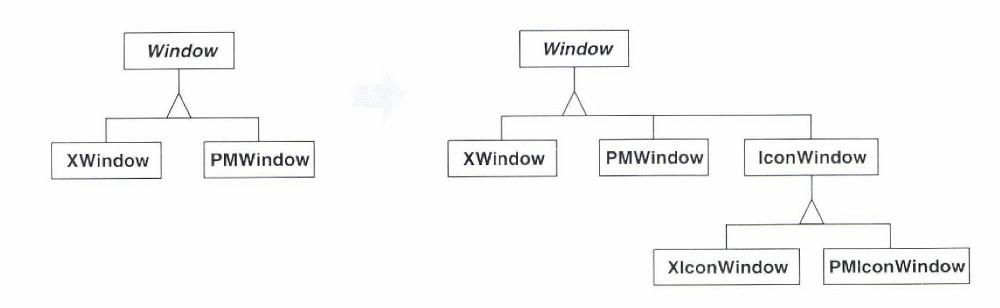
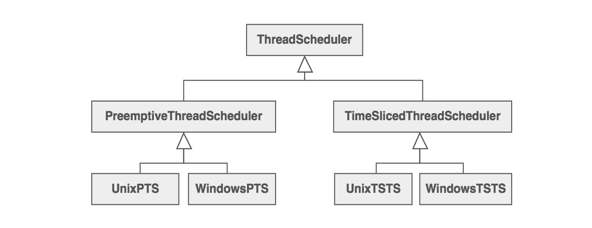
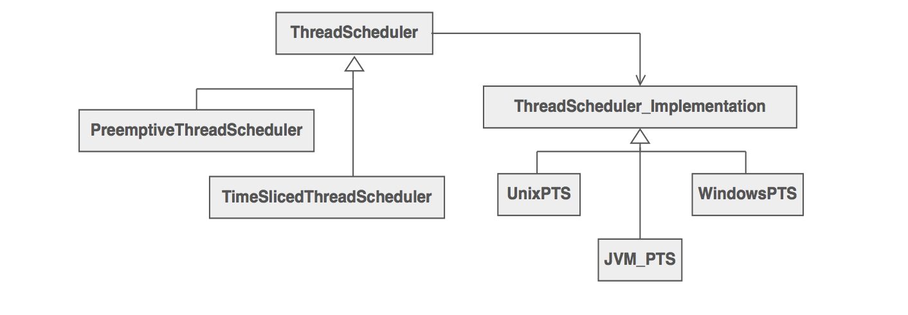
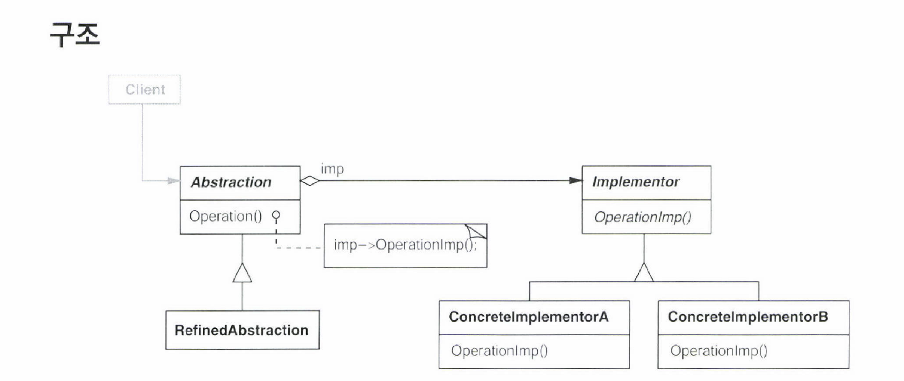

# Bridge

###  의도

- 구현에서 추상을 분리하여, 독립적인 다양성을 갖게한다

### 다른 이름

- 핸들/구현부(Handle,Body)  

### 하나의 추상적인 개념이 여러가지 구현으로 구체화 될 수 있을 때

- 예시 상황: 이식성 있는 Window (추상적개념)과 이를 사용자 인퍼테이스 툴킷을 써서 구현할 때 
    - X윈도우 시스템에서 운영가능한 응용프로그램 또는 IBM의 프레젠테이션 매니저에서 운영되는 운영프로그램에 적용가능


- Case 1. 상속(Inheritance)
    - 방법: 추상 클래스로 인터페이스를 정의하고 구체적인 서브클래스에서 인터페이스를 구현
    - 예시: Window 추상 클래스와 이를 구현하는 PMWindow, XWindow
    
    - 단점: 추상의 확장이 어려움
        - 예시: 새로운 종류의 윈도우 마다 서로 다른 플랫폼을 지원하는데 필요한 클래스를 계속 개발해야
    - 단점: 사용자 코드가 플랫폼에 종속
        - 예시: 사용자는 구체 클래스를 직접 알아야하고 이로 인해 이식성이 떨어짐
          
            
- Case 2. 가교(Bridge)
    - 방법: 추상적 개념에 해달하는 클래스 계통과 구현에 해당하는 클래스 계통을 분리
    - 예시: 개념(Window)와 구현(WindowImpl)을 분리하고 플랫폼 종속적인 구현은 impl에서 정의
        - 구현(impl)은 플랫폼별 서브클래스를 갖게 된다
        - 클래스에 대한 새로운 개념은 Window의 서브클래스가 되고
        - 해당 개념에 대한 구현은 플랫폼 종속적인 서브클래스에 의해 구현 가
    
    
    
- 예시 상황 2: [ThreadScheduler 와 OS](https://sourcemaking.com/design_patterns/bridge)

    - 상속 

    
    - 상속의 문제점
  
 
    - Bridge 적용

        - The Bridge design pattern proposes refactoring this exponentially explosive inheritance hierarchy into two **orthogonal** hierarchies – one for platform-independent abstractions, and the other for platform-dependent implementations.


## 활용성

- 다음과 같은 경우에 사용
    - 추상적 개념과 이에 대한 구현 사이의 (지속적인) 종속 관계를 피하고 싶을 때
        - 런타임에 구현방법을 선택하거나 구현 내용을 변경하고 싶을 때
    - 추상과 구현 모두 독릭접으로 서브클래싱을 통해 확장되어야 할 때
    - 추상에 대한 구현 내용변경이 다른 영향을 주지 않을 때 
        - 구현 클래스가 변경되어도 다시 컴파일 되지 않아야함
    - (c++) 사용자에게서 구현을 완벽하게 은닉하길 원할 때 
        - c++에서는 구현방식이 인터페이스에 모두 노출됨
        - 가교를 이용하면 구현 클래스에 대한 참조만 있으므로 은닉
    - 클래스 수가 급증하는 것을 방지하고자 할 때
        - 하나의 이유로 여러개의 클래스가 정의 되어야 한다면 분리가 필요하다 
            - "중첩된 일반화(Nested Generalization)" - Rumbaugh
    - 여러 객체에 구현을 공유하고 사용자에 이런 사실을 공개하고 싶지 않을 때 
        - String
        

## 참여자



- Abstraction(Window): 추상적 개념에 대한 인터페이스 제공, 객체 구현에 대한 참조자 관리
- RefinedAbstraction(IconWindow): 추상적 개념에 정의된 인터페이스를 확장
- Implementor(WindowImpl): 구현 클래스에 대한 인터페이스 제공, 공통적 연산의 시그니처만 정의. 
    - Abstraction 에 정확하게 대응할 필요 없다. 일반적으로 기본적인 구현 연산만 수행
- ConcreteImplementor(XWindowImpl, PMWWindowImpl): Implementor 인터페이스를 구현하는 실제적인 구현 

## 협력방법

- Abstraction 클래스가 사용자 요청을 Implementor 객체를 전달

## 결과

- Profits
    - 인터페이스와 구현의 분리
        - 구현이 인터페이스에 읽매이지 않고 어떤 구현 방식을 택할지 런타임에 결정 가능, 컴파일 타임 의존성 제거
    - 확장성 제고
        - Abstraction 과 Implementor 를 독립적으로 확장 가능
        - 구현 세부 사항을 사용자로 부터 숨김
         
## 구현 방법
- Implementor 는 하나만
    - 구현방법이 하나일 때는 Implementor 를 추상클래스로 정의하는 것은 불필요
    - 그럼에도 추상적 개념과 구현부를 분리하는 것은 여전히 의미가 있음
        - 사용자를 클래스 구현의 변경에서 독립시킨다는 관점(구현이 변경되어도 컴파일 하지 않아도 ) 됨
        
- 정확한 Implementor 생성
    - 생성자의 매개 변수에 따라 선택, 기본 구현 선택 후 필요에 따라 선택, 결정 위임, etc... 
    
- Implementor 공유

- 다중 상속 이용 (c++에서 가능, java에서는 불가)

## 관련 패턴
- 추상 팩토리 패턴: 특정 가교를 생성하고 복합할 수 있음
- 적응자 패턴: 서로 관련없는 클래스들이 함께 동작하도록, 보통 각 클래스의 설계가 끝난 후에 적
- 가교 패턴: 설계 단계 초기에 초상화 및 구현이 독립적으로 다양화 되도록 만드는데 쓰임

## [Shape and Color](https://www.journaldev.com/1491/bridge-design-pattern-java)


- Abstraction 

```
public abstract class Shape {
	//Composition - implementor
	protected Color color;
	
	//constructor with implementor as input argument
	public Shape(Color c){
		this.color=c;
	}
	
	abstract public void applyColor();
}
```

- Implementor

```
public interface Color {

	public void applyColor();
}
```

- RefinedAbstraction
 ```
 public class Triangle extends Shape{
 
 	public Triangle(Color c) {
 		super(c);
 	}
 
 	@Override
 	public void applyColor() {
 		System.out.print("Triangle filled with color ");
 		color.applyColor();
 	} 
 
 }
 ```

```
 public class Pentagon extends Shape{
    
    	public Pentagon(Color c) {
    		super(c);
    	}
    
    	@Override
    	public void applyColor() {
    		System.out.print("Pentagon filled with color ");
    		color.applyColor();
    	} 
    
    }
 ```
   
- ConcreteImplementor
```   
   public class RedColor implements Color{
   
   	public void applyColor(){
   		System.out.println("red.");
   	}
   }
```

```   
public class GreenColor implements Color{

	public void applyColor(){
		System.out.println("green.");
	}
}
``` 
  
- Use 
```
   public static void main(String[] args) {
   		Shape tri = new Triangle(new RedColor());
   		tri.applyColor();
   		
   		Shape pent = new Pentagon(new GreenColor());
   		pent.applyColor();
   	}
```