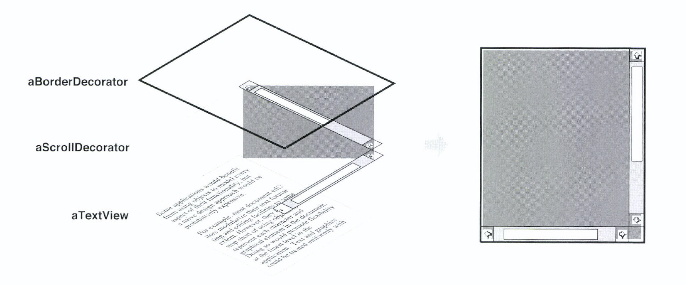
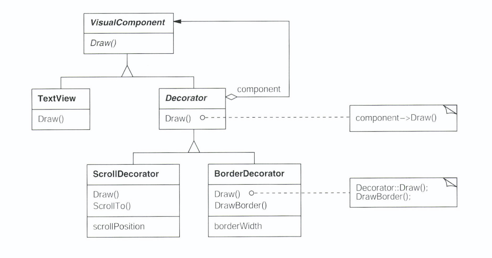

# Decorator

# Decorator Pattern (Wrapper)

## 의도

- 객체에 동적으로 새로운 책임을 부여
- 기능을 추가하려면 Sub Class를 생성하는 것보다 융통성 있는 방법 제공

## 동기

- 가끔 전체 Class에 새로운 기능을 추가할 필요는 없으나 개별적인 객체에 새로운 책임을 추가할 필요가 있음
    - e.g) GUI Toolkit에서 모든 사용자 인터페이스 요소에는 필요 없지만, 어떤 사용자 인터페이스 요소에만 Scrolling이나 Border 같은 속성을 추가하고 싶음
- 일반적인 방법은 Class 상속을 통하여 기능을 추가하는 것
    - 정적 타임에 이루어지므로, 사용자는 구성 요소를 언제, 어떻게  테두리로 장식해야 할지 제어할 수 없음
- Decorator : 지금 필요한 테두리를 추가하는 다른 객체에 해당 구성요소를 둘러싸는 방법
    - 자신이 둘러싼 요소, 구성요소가 갖는 Interface를 동일하게 제공 → 장식자의 존재는 사용자에게 감춰짐
    - 즉, Decorator는 둘러싼 구성요소로 전달되는 요청을 중간에 가로채서 처리한 뒤 전달함
    - Decorator로 둘러싼 상태에서 다시 다른 Decorator로 둘러싸는 중첩이 가능
        - 책임 추가를 무한정으로 할 수 있음!



- Text를 출력하는 TextView Class가 있고 Scroll을 추가하여 ScrollDecorator를 추가하고 Border를 추가하기 위하여 BorderDecorator를 추가함




- VisualComponent Class는 Visual 객체를 위한 Abstract Class
- Decorator Class는 단순하게 Draw()에 대한 요청을 자신이 갖는 요소에 전달 (Component→Draw())
    - Decorator Class의 Sub Class들은 Draw() 연산을 확장하여 필요한 기능을 구현함
    - Decorator Class의 Sub Class들은 필요한 기능을 구현하기 위하여 메소드를 추가할 수 있음
    - BorderDecorator는 기본적인 화면에 보이는 기능을 부모 Class에서 제공받도록 부모 Class에 정의된 Decorator::Draw()를 먼저  호출하고 추가로 자신에게 정의된 DrawBorder()를 호출함
- Decorator는 VisualComponent에 모두 적용할 수 있음
    - 즉, 다른 Decorator들도 Component이므로 적용할 수 있다는 의미 → 중첩이 가능하다.

## 활용성

- 동적으로 또한 투명하게, 다시 말해 다른 객체에 영향을 주지 않고 개개의 객체에 새로운 책임을 추가할 수 있음
- 제거될 수 있는 책임에 대해 사용
- 실제 상속으로 Sub Class를 계속 만드는 방법이 실질적이지 못할 때 사용함
    - 너무 많은 수의 독립된 확장이 가능할 때 모든 조합을 지원하기 위해 이를 상속으로 해결하면 Class 수가 폭증

## 구조 & 참여자


- Component
    - 동적으로 추가할 서비스를 가질 가능성이 있는 객체들에 대한 Interface
- ConcreteComponent
    - 추가적인 서비스가 실제로 정의되어야 할 필요가 있는 객체
- Decorator
    - Component 객체에 대한 참조자를 관리하며, Component에 정의된 Interface를 만족하도록 Interface 정의
- ConcreteDecorator
    - Component에 새롭게 추가할 서비스를 실제로 구현하는 Class

## 협력방법

- Decorator는 자신의 Component 객체 쪽으로 요청을 전달
- 요청 전달 전 및 후에 자신만의 추가 연산을 선택적으로 수행

## 결과

- 단순한 상속보다 설계의 융통성을 더 많이 증대시킬 수 있음
    - 객체에 새로운 책임을 추가하거나 삭제하는 일이 런타임에 가능해짐
    - 상속은 코드에서, 즉 정적으로 새로운 Class를 추가해야만 추가적인 행동을 정의할 수 있음
        - 예를 들어, 스크롤 기능이 추가되려면 ScorlledTextView
        - 테두리 기능이 추가되려면 BorderedTextView
        - 두 기능이 추가되려면 BorderedScrollableTextView를 또 생성해야함
- Class Hierarchy의 상부측 Class에 많은 기능이 누적되는 상황을 피할 수 있음
    - 필요한 비용만 그 때 지불하는 (OnDemand)  방법을 제공
    - 지금 예상하지 못한 특성들을 한꺼번에 다 개발하기 위해 고민하고 노력하기 보다는 현재 발견되지 못하고 누락된 서비스들은 추후 Decorator로 추가할 수 있음
        - 혹은 현재 존재하는 Decorator의 조합으로 새로운 기능이 추가될 수도 있음

## 구현 예제

## 1) GOF - VisualComponent

```cpp
    class VisualComponent {
    public:
    	VisualComponent();
    	
    	virtual void Draw();
    	virtual void Resize();
    };
```

- VisualComponent의 Sub Class로 Decorator를 정의

```cpp
    class Decorator : public VisualComponent {
    public:
    	Decorator(VisualComponent *);
    
    	virtual void Draw();
    	virtual void Resize();
    
    private:
    	VisualComponent *_component;
    };
    
    void Decorator::Draw() {
    	_component->Draw();
    }
    
    void Decorator::Resize() {
    	_component->Resize();
    }
```

- Decorator는 _component 내부 변수로 참조되는 VisualComponent에 기능을 추가함

```cpp
    class BorderDecorator : public Decorator {
    public:
    	BorderDecorator(VisualComponent *, int borderWidth);
    	virtual void Draw();
    
    private:
    	void Drawborder(int);
    	int _width;
    }
    
    void BorderDecorator::Draw() {
    	Decorator::Draw();
    	DrawBorder(_width);
    }
```

- Decorator의 Sub Class는 자기 자신만의 기능을 추가하여 private method로 정의함

```cpp
    // 단순 TextView 생성
    Window *window = new Window();
    TextView *textView = new TextView();
    window->setContents(textView);
    
    // Decorated TextView
    window->setContents(new BorderDecorator(new ScrollDecorator(textView), 1));
```

## 2) LINE Armeria - OpenSource Asynchronous RPC/API Client/Server Library

- [https://line.github.io/armeria/](https://line.github.io/armeria/)
- [https://github.com/line/armeria](https://github.com/line/armeria)

- SimpleDecoratingHttpClient

```java
    public abstract class SimpleDecoratingHttpClient extends SimpleDecoratingClient<HttpRequest, HttpResponse>
            implements HttpClient {
        /**
         * Creates a new instance that decorates the specified {@link HttpClient}.
         */
        protected SimpleDecoratingHttpClient(HttpClient delegate) {
            super(delegate);
        }
    }
```

- Concrete Decorator


- e.g) CircuitBreakerDecorator
    - [https://github.com/line/armeria/blob/master/core/src/main/java/com/linecorp/armeria/client/circuitbreaker/AbstractCircuitBreakerClient.java#L104](https://github.com/line/armeria/blob/master/core/src/main/java/com/linecorp/armeria/client/circuitbreaker/AbstractCircuitBreakerClient.java#L104)
    - [https://github.com/line/armeria/blob/master/core/src/main/java/com/linecorp/armeria/client/circuitbreaker/CircuitBreakerClient.java#L142](https://github.com/line/armeria/blob/master/core/src/main/java/com/linecorp/armeria/client/circuitbreaker/CircuitBreakerClient.java#L142)
- Decorator의 사용

```java
    import com.linecorp.armeria.client.WebClient;
    import com.linecorp.armeria.client.circuitbreaker.CircuitBreaker;
    import com.linecorp.armeria.client.circuitbreaker.CircuitBreakerClient;
    import com.linecorp.armeria.client.circuitbreaker.CircuitBreakerStrategy;
    import com.linecorp.armeria.common.AggregatedHttpResponse;
    import com.linecorp.armeria.common.HttpRequest;
    import com.linecorp.armeria.common.HttpResponse;
     
    CircuitBreakerStrategy strategy = CircuitBreakerStrategy.onServerErrorStatus();
    WebClient client = WebClient
            .builder(...)
            .decorator(CircuitBreakerClient.builder(strategy)
                                           .newDecorator())
    				.decorator(ConcurrencyLimitingClient.newDecorator(3))
            .decorator(MetricCollectingClient.newDecorator(
                                DesignPatternMeterIdPrefixFunction.of("Design Pattern Server")))
            .build();
     
    AggregatedHttpResponse res = client.execute(...).aggregate().join(); // Send requests on and on.
```

- Decorating a service ([https://line.github.io/armeria/server-decorator.html#server-decorator](https://line.github.io/armeria/server-decorator.html#server-decorator))

```java
    import com.linecorp.armeria.common.HttpResponse;
    import com.linecorp.armeria.common.HttpStatus;
    import com.linecorp.armeria.server.HttpService;
     
    ServerBuilder sb = Server.builder();
    HttpService service = ...;
    sb.serviceUnder("/web", service.decorate((delegate, ctx, req) -> {
        if (!authenticate(req)) {
            // Authentication failed; fail the request.
            return HttpResponse.of(HttpStatus.UNAUTHORIZED);
        }
     
        // Authenticated; pass the request to the actual service.
        return delegate.serve(ctx, req);
    });
```

- Service Decorator의 사용

```java
    return new GrpcServiceRegistrationBean()
                    .setService(GrpcService.builder()
                                           .addService(new HelloServiceImpl())
                                           .supportedSerializationFormats(GrpcSerializationFormats.values())
                                           .enableUnframedRequests(true)
                                           .build())
                    .setDecorators(ImmutableList.of(
                            AuthService.newDecorator(new Authorizer(oAuthAuthroizer)),
                            BraveService.newDecorator(httpTracing),
                            LoggingService.newDecorator()));
```