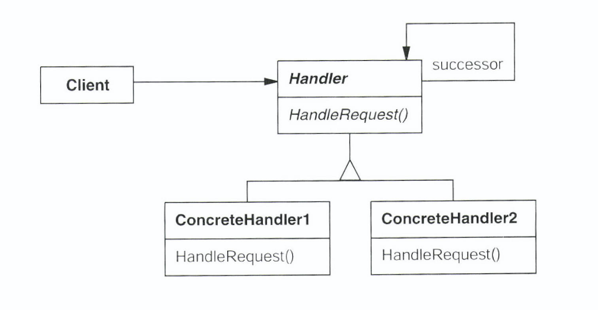

# Chain of responsibility

## 의도

- 메시지를 보내는 객체와 이를 받아 처리하는 객체들 간 결합도를 없애기 위한 패턴
- 하나의 요청에 대한 처리가 한 객체에서만 되지 않고 여러 객체에게 처리 기회를 주는 것

## 동기

- GUI의 Context Sensitive 도움말 기능
    - 도움말의 내용은 선택한 GUI 요소가 무엇이며 그 요소의 상황에 따라 다를 수 있음
- 도움말을 제공해야 할 객체가 도움말 요청을 보내는 객체에 알려져 있지 않음
    - 요청을 일으키는 객체는 실제로 자신에게 해당 도움말을 제공하는 객체가 누구인지 알 수 없음
- 도움말 요청을 발생시키는 버튼과 도움말 정보를 제공하는 객체를 분리해야할 필요가 있으면 이 부분의 기작을 정의하는 것이 책임연쇄패턴


- 기본 아이디어는 메시지 송신측과 수신측으로 분리
    - 요청을 처리할 기회를 다른 객체에 분산
    - 요청은 실제 요청을 처리할 객체를 찾을 때까지 연결 고리를 따라 Propagation
- 송신측이 자신이 아는 주체에 처리를 요청하면 수신 객체가 자신과 연결된 고리를 따라서 요청을 전달하고, 그 중 한 객체가 정의된 서비스를 제공

- 일반적인 버튼은 특별한 도움말이 없지만 Print 버튼은 출력되는 도움말을 넣고 싶음
    - 사용자가 어떤 객체의 경우는 해당 객체 인터페이스를 통해 도움말을 얻을 수 있고 어떤 객체의 경우는 다른 객체를 통해 도움말을 얻을 수 있는 사실을 하드코딩하는 것은 바람직 하지 않음


- PrintButton은 자신의 도움말을 출력해야하는 객체가 누구인지 모름
    - 일단 PrintDialog에 요청하지만 도움말을 처리하지 않고 Application까지 전파되어 처리됨
- 요청을 궁극적으로 처리할 객체의 직접적인 참조자는 없음


- 연결 고리를 따라 요청을 계속 전달할 수 있어야 함
- 수신 객체를 명시할 수 없는 상황을 고려하면 연결고리 상의 모든 객체는 동일한 요청을 처리해야 함
    - 연결 고리의 모든 객체들은 공통의 인터페이스를 갖는다. ⇒ 하나의 Class 계통으로 정의
    - HelpHandler에 HandleHelp() 정의
        - 기본 구현 : 자신에게 도달한 요청을 연결 고리에 정의된 다음번 객체에게 전달
        - 상속받는 서브 클래스 : 제공할 도움말이 있으면 제공하도록 재정의

## 활용성

- 하나 이상의 객체가 요청을 처리해야하고, 그 요청 처리자 중 어떤 것이 선행자인지 모를 때 처리자가 자동으로 확정되어야 함
- 메시지를 받을 객체를 명시하지 않은 채 여러 객체 중 하나에게 처리를 요청하고 싶을 때
- 요청을 처리할 수 있는 개체 집합이 동적으로 정의되어야 할 때

## 구조




- Handler (HelpHandler) : 요청을 처리하는 인터페이스를 정의, 후속 처리자와 연결 구현
- ConcreteHandler : 자신이 처리할 행동이 있으면 처리하고 없으면 후속 처리자에 다시 요청
- Client : ConcreteHandler 객체에 필요한 요청을 보냄

## 협력 방법

- 사용자는 처리를 요청하고, 처리 요청은 실제로 그 요청을 받을 책임이 있는 ConcreteHandler 를 만날 때까지 연결고리를 따라서 계속 전달됨

## 결과

- 객체 간의 행동적 결합도가 적어짐
    - 객체가 관련된 후보 객체들을 다 알필요 없이 단순하게 자신과 연결된 하나의 객체에만 메시지를 보내기만 하면됨
    - 메시지가 어떠한 객체에 어떻게 처리되는지 알 수 없음
- 객체에게 책임을 할당하는 데 유연성을 높일 수 있음
    - 책임을 여러 객체에게 분산 시킬 수 있음
    - 런타임에 객체 연결 고리를 변경하거나 추가하여 책임을 변경하거나 확장 가능
- 단점 : 메시지 수신이 보장되지 않음

## 구현

1. 후속 처리자들의 연결 고리 구현
2. 후속 처리자 연결하기

```cpp
        class HelpHandler {
        public:
        	HelpHandler(HelpHandler *s) : _successor{s};
        	virtual void handleHelp();
        private:
        	HelpHandler *_successor;
        }
        
        void HelpHandler::handleHelp() {
        	if (_successor) {
        		_successor->HandleHelp();
        	}
        }
```

3. 처리 내용은 어떻게 정의할 것인가?
    - Request Class의 SubClass 객체로 정의한다.
        - 새로운 처리 요청은 상속하여 매개변수를 정의
        - Request Class내에는 처리 요청을 식별하기 위한 정보를 정의해야
            - 이 방법이 안된다면 RTTI 등의 옵션을 켜야.. (런타임에 타입 정보를 파악하기 위하여)

```cpp
        void Handler::handleRequest (Request *request) {
        		switch (request->getKind()) {
        			case Help:
        				handleHelp((HelpRequest*) request);
        				break;
        			case Print:
        				handleHelp((PrintRequest*) request);
        				break;
        			default:
        				break;
        		}
        }
```

- handleRequest() 상속 후 재정의하면 새로운 처리 방법을 구현할 수 있음
  - 서브 클래스는 관심 있는 처리 요청만 담당하도록 정의

```cpp
        class ExtendedHandler : public Handler {
        public:
        	virtual void handleRequest(Request *request);
        }
        
        
        void ExtendedHandler::handleRequest(Request *request) {
        	switch (request->getKind()) {
        		case Preview:
        			// 처리
        			break;
        		default:
        			Handler::handleRequest(request);
        	}
        }
```

## 사용 예제

- java.util.logging.Logger#log()
- javax.servlet.Filter#doFilter()
- try catch block