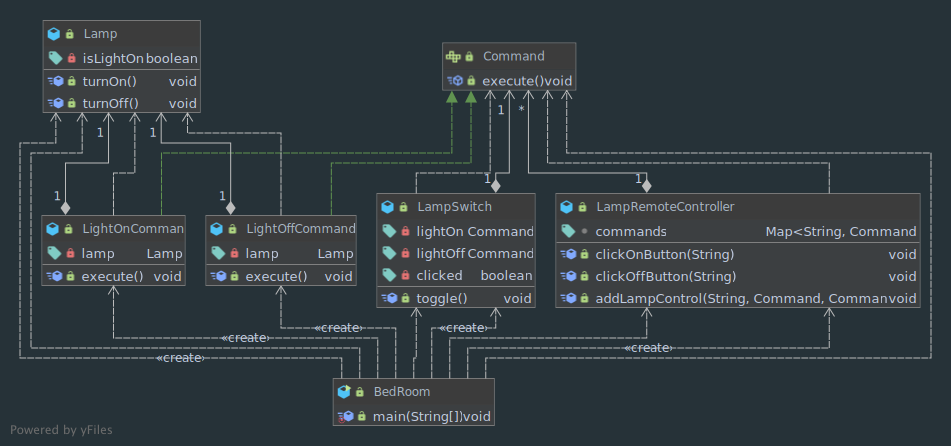

# Command 패턴

> 커맨드 패턴(Command pattern)이란 요청을 객체의 형태로 캡슐화하여 사용자가 보낸 요청을 나중에 이용할 수 있도록 매서드 이름, 매개변수 등 요청에 필요한 정보를 저장 또는 로깅, 취소할 수 있게 하는 패턴이다.

## 구조


* 명령(Command): 수신자 객체를 의존하고, 수신자 객체의 메서드를 호출(invoke)한다. 수신자 메서드를 호출할 때 필요한 파라미터를 저장한다.
* 수신자(Receiver): 커맨드 객체가 호출할 객체이다. 수신자의 메서드는 커맨드 객체가 호출할 때 실행된다.
* 호출자(Invoker/Caller): 커맨드 객체를 실행하는 방법과 명령을 실행할 때 추가적인 작업을 수행한다.
* 클라이언트(Client): 클라이언트는 명령, 수신자, 호출자 객체를 모두 관리한다.
  * 커맨드 객체가 알아야하는 수신자 객체를 결정한다.
  * 호출자 객체가 알아야하는 커맨드 객체를 결정한다.


## 구현: 스위치 예제

헤드 퍼스트 디자인 패턴의 스위치 예제를 구현해본다. 아래와 같은 침실이 있다고 가정한다. 침실엔 테이블 램프와 펜던트 램프가 존재한다. 모든 램프는 리모컨으로 켜거나 끌 수 있고, 램프의 스위치로도 조작 가능하다.


* 명령(Command): `Command` 인터페이스를 상속받은 클래스
* 수신자(Receiver): `Lamp`
* 호출자(Invoker/Caller): `LampSwitch`, `LampRemoteController`
* 클라이언트(Client): `BedRoom`



## Java API: `Thread`

쓰레드 객체는 사용자가 하고자하는 작업을 객체로 생성한 뒤에 원하는 시점에 실행한다.

```java
package shawn.designpattern.command;

public class ThreadExample {
    public static void main(String[] args) {
        Thread t = new Thread(() -> {
            System.out.println("요청한 작업을 수행한다.");
        });

        // Do something

        // 원할 때 쓰레드를 실행한다.
        t.start();
    }
}
```

## 특징

* SRP: 호출하는 클래스(Invoker)와 실제 작업을 수행하는 클래스(Receiver)의 결함을 끊을 수 있다.
* OCP: 코드를 수정하지 않고 새로운 명령을 도입할 수 있다.
* 명령의 객체화로 얻는 이점
  * Undo/Redo: 명령이력을 저장하여 작업을 되돌리거나 재수행할 수 있다.
  * 지연 실행: 원하는 시점에 명령을 수행한다.

## 다른 패턴과의 관계

* 발신자의 요청을 수신자에게 연결하는 패턴들
  * **책임 연쇄(Chain of Responsibility)**: 요청을 다음 수신자에게 전달한다. 이 요청은 실제 요청을 수행할 객체가 나타날 때까지 계속 전달된다.
  * **명령(Command)**: 발신자에서 수신자로의 단방향(unidirectional)으로 연결한다.
  * **중재자(Mediator)**: 발신자와 수신자 사이의 연결을 제거하고, 중재자 객체를 통해서만 통신할 수 있다.
  * **관찰자(Observer)**: 수신자는 요청 수신을 구독하거나 구독취소를 할 수 있다.
* **책임 연쇄 패턴**의 핸들러는 커맨드 패턴으로 구현할 수 있다.
* 명령 패턴과 **메멘토(Memento)** 패턴은 Undo 기능을 구현하는데 함께 사용할 수 있다.
* 커맨드 패턴과 **전략(Strategy) 패턴**은 동작을 객체로 만든다는 점에서 유사하게 보인다.
  * 커맨드 패턴을 사용해서 동작을 객체로 변환한다. 이로 인해 다음 작업을 수행할 수 있다.
    * 작업의 수행을 지연시킨다.
    * 작업을 대기열로 관리한다.
    * 명령 이력을 관리한다.
    * 명령을 리모트 서비스로 송신할 수 있다.
  * 전략 패턴은 동일 동작을 여러 방법으로 묘사한다. 단일 컨텍스트에서 전략을 선택할 수 있다.

## 참고

* [Wikipedia](https://en.wikipedia.org/wiki/Command_pattern)
* [Refactoring Guru](https://refactoring.guru/design-patterns/command)