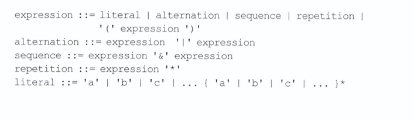
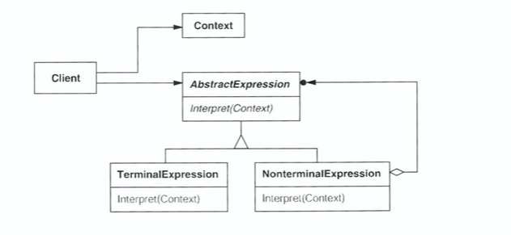

# Interpreter

###  의도

- 어떤 언어에 대해, 그 언어의 **문법에 대한 표현을 정의**하고 기술된 **문장을 해석하는 해석자를 함께 정의**  
- Interpreter pattern is used to defines a grammatical representation for a language and provides an interpreter to deal with this grammar.

### 동기
- 문장의 표현과 해석을 정의함으로써 알고리즘을 매번 작성할 필요성을 없앤다.

### 예시 - 정규표현식 

- 정규 표현식(Regular Expression) 
    - [특정한 규칙을 가진 문자열의 집합을 표현하는 데 사용하는 형식 언어](https://ko.wikipedia.org/wiki/%EC%A0%95%EA%B7%9C_%ED%91%9C%ED%98%84%EC%8B%9D)

    
- expression 은 문법의 시작 기호
- literal 은 간단한 단어를 정의하는 terminal 기호 
- 클래스를 이용하여 각각의 문법이 갖는 규칙을 정의


- raining & (dogs | cats) *

    
- LiteralExpression 은 자신이 정의한 문자와 일치하는 정보가 입력 매개변수에 있는지 확인 
- AlternationExpression 은 입력 매개변수에 따른 대안 문자들과 일치하는 것이 있는지 확인
- RepetitionExpression 은 입력에 자신이 반복하는 표현에 대한 여러개의 본사본이 존재하는지 확인
    
### 활용성
- 해석이 필요한 언어가 존재하거나 추상구문 트리로서 언어의 문장을 표현하고자 할 때
- **[추상 구문 트리 (Abstract Syntax Tree)](https://en.wikipedia.org/wiki/Abstract_syntax_tree)**


###  구조 및 참여자
  
- AbstractExpression (RegularExpression): 
    - 추상 구문 트리에 속한 모든 노드에 해당하는 클래스들이 공통으로 가져야할 interpret() 를 추상으로 정의
- TerminalExpression (LiteralExpression): 
    - 문법에 정의한 터미널 기호와 관련된 해석 방법을 구현
- NonterminalExpression (AlternationExpression, RepetitionExpression, SequenceExpression): 
    - 문법의 오른편에 나타나는 모든 기호에 대해서 클래스를 정의
- Context: 번역기에 대한 포괄적이 정보를 포함
- Client: 언어로 정의한 특정 문장을 나타내는 추상 구문 트리. 추상 구문 트리는 NonterminalExpression 과 TerminalExpression 으로 구성

    
### 협력 방법
- 사용자는 NonterminalExpression 과 TerminalExpression 인스턴스들로 해당 문장에 대한 추상 구문 트리를 만든다
- 각 NonterminalExpression 는 또 다른 서브표현식에 대한 interpret()를 이욯하여 자신의 interpret()를 정의.
- 각 노드에 정의한 interpret() 연산은 해석자의 상태를 저장하거나 그걸을 알기 위해 문맥(context)를 이용 
  
### 결과
- pros
    - 문법의 변경과 확징이 쉽다 
        - 문법에 정의된 규칙을 클래스로 표현했기 때문에 문법의 변경이나 확장은 상속을 통해 가능
        - 확장을 통해 기존의 표현식을 수정하거나 새로운 서브클래스 정의를 통해 새로운 표현식 정의 가능
    - 문법의 구현이 용이하다
        - 추상 구문트리의 노드에 해당하는 클래스들은 비슷한 구현방법을 갖기 때문에 작성하기 쉽고 컴파일러나 파서 생성기로 자동 생성도 가능
    - 표현식을 해석하는 새로운 방법 추가 가능
        - 새로운 연산을 정의하며 새로운 방식으로 해석하는 방법을 추가 할 수 있다
- cons: 
    - 복잡한 문법은 관리 어려움
        - 각 규칙별로 적어도 하나의 클래스를 정의해야하고 BNF로 정의한 문법은 훨씬 많은 클래스 필요
            -문법이 복잡하면 클래스 계통이 복잽해지기 때문에 파서생성기를 쓰는 것이 낫다
                - 파서생성기 = 추상 구문 트리를 생성하지 않고 문장 해석이 가능

### 구현
- Composite 패턴과 겹치는 사항들이 많다 (composite-pattern 을 이용하여 interpreter-pattern 의 일부분 부현 가능)
    - Structural Design Patterns
        - Generally deal with **relationships** between entities, making it easier for these entities to work together.
    - Behavioral Design Patterns:
        - Used in **communications** between entities and make it easier and more flexible for these entities to communicate.
    - Interpreter 패턴에만 해당 되는 사항
        - 추상 구문 트리를 생성 
            - 해석자 패턴은 어떻게 추상 구문 트리를 생성하는 지는 다루지 않음 (파싱 과정에 관한 패턴이 아님)
        - Interpret() 연산을 정의 
        - Flyweight 패턴을 적용하여 terminal 기호를 공
### 예제 코드

- Assume 
    - input: “<Number> in Binary” 또는 “<Number> in Hexadecimal”
    - output: “<Number> in Hexadecimal= <Number_Binary_String>” 또는" <Number> in Binary= <Number_Binary_String>” 


    

Step 1. Create Interpreter Context 
```
public class InterpreterContext {

	public String getBinaryFormat(int i){
		return Integer.toBinaryString(i);
	}
	
	public String getHexadecimalFormat(int i){
		return Integer.toHexString(i);
	}
}
```


Step 2. Create an Expression interface that will consume the interpreter context.
```
public interface Expression {
	String interpret(InterpreterContext ic);
}
```

Step 3. Create concrete classes implementing the above interface.
```
public class IntToBinaryExpression implements Expression {

	private int i;
	
	public IntToBinaryExpression(int c){
		this.i=c;
	}
	@Override
	public String interpret(InterpreterContext ic) {
		return ic.getBinaryFormat(this.i);
	}

}

public class IntToHexExpression implements Expression {

	private int i;
	
	public IntToHexExpression(int c){
		this.i=c;
	}
	
	@Override
	public String interpret(InterpreterContext ic) {
		return ic.getHexadecimalFormat(i);
	}

}
```
Step 4. Create client application that will have the logic to **parse** the user input and pass it to correct expression and then use the output to generate the user response
```
public class InterpreterClient {

	public InterpreterContext ic;
	
	public InterpreterClient(InterpreterContext i){
		this.ic=i;
	}
	
	public String interpret(String str){
		Expression exp = null;
		//create rules for expressions
		if(str.contains("Hexadecimal")){
			exp=new IntToHexExpression(Integer.parseInt(str.substring(0,str.indexOf(" "))));
		}else if(str.contains("Binary")){
			exp=new IntToBinaryExpression(Integer.parseInt(str.substring(0,str.indexOf(" "))));
		}else return str;
		
		return exp.interpret(ic);
	}
	
	public static void main(String args[]){
		String str1 = "28 in Binary";
		String str2 = "28 in Hexadecimal";
		
		InterpreterClient ec = new InterpreterClient(new InterpreterContext());
		System.out.println(str1+"= "+ec.interpret(str1));
		System.out.println(str2+"= "+ec.interpret(str2));
	}
}
```

### 참고자료
[Let’s Build A Simple Interpreter. Part 7: Abstract Syntax Trees](https://ruslanspivak.com/lsbasi-part7/)

[What is an Abstract Syntax Tree](https://blog.bitsrc.io/what-is-an-abstract-syntax-tree-7502b71bde27)

[On the Composite and Interpreter Design Patterns](https://dzone.com/articles/on-the-composite-and-interpreter-design-patterns)

[Design Patterns - Interpreter Pattern](https://www.tutorialspoint.com/design_pattern/interpreter_pattern.htm)

[Interpreter Design Pattern in Java](https://www.journaldev.com/1635/interpreter-design-pattern-java)