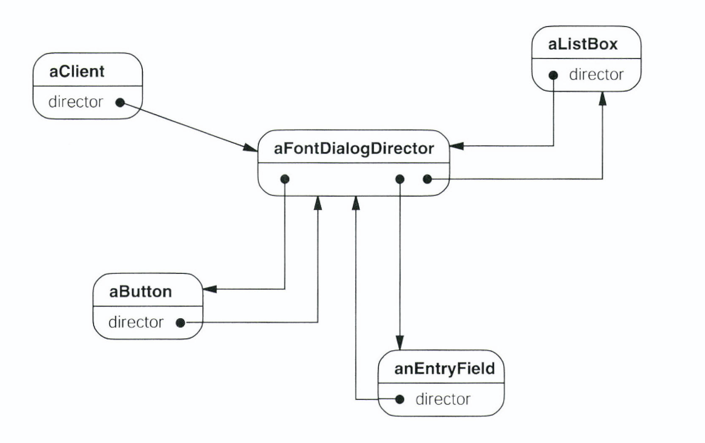
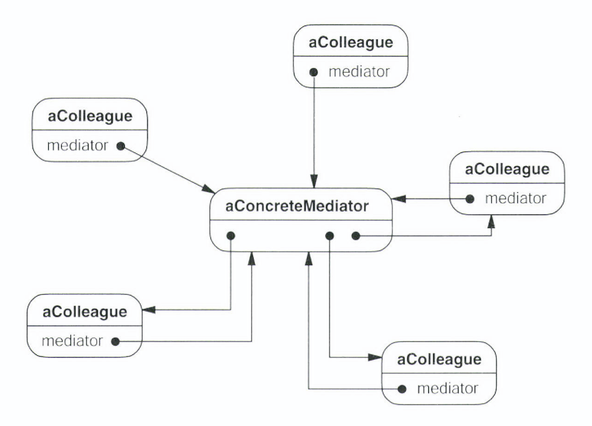

# Mediator

## Mediator - 중재자

## 의도

- 한 집합에 속해있는 객체의 상호작용 캡슐화
- 객체들이 직접 서로를 참조하지 않도록 객체 사이의 Loose Coupling을 촉진

## 동기

- 객체 지향 개발 방법론에서는 행동을 여러 객체에 분산 시켜 처리하도록 권하고 있음
    - 시스템을 여러객체로 분할하면 객체의 재사용 성을 증대시킬 수 있음
    - 객체 구조는 수 많은 연결 관계가 객체 사이에 존재하게 됨
- 그러나 객체 간 상호작용의 급증이 유박되고, 오히려 재사용성이 저하될 수 있음
    - 행동이 여러 객체에 걸쳐 분산되어있으면 시스템의 행동을 수정할 때 여러 클래스들을 재정의해야할 수도 있음
- 별도의 중재자 (Mediator) 객체를 활용하면 상호작용과 관련된 행동을 하나의 객체로 모아서 이러한 문제들을 풀 수 있음
    - 그룹 내 객체들에 대한 참조를 중재자가 관리
- GUI Widget의 상호작용 예제

- 객체간 상호작용을 Mediator에서 관리한다.

- 위젯끼리는 서로 직접 메시지를 주고 받지 않음
    - 즉, 서로에 대한 정보는 전혀 필요 없고, 단순히 지시자가 누구인지만 알면 됨

## 활용성

- 여러 객체가 잘 정의된 형태이긴 하지만 복잡한 상호작용을 할 때
- 한 객체가 다른 객체를 너무 많이 참조하고 너무 많은 의사소통을 수행하여 재사용이 힘들 때
- 여러 클래스에 분산된 행동들이 상속 없이 상황에 맞게 수정되어야 할 떄

## 구조

## 참여자

- Mediator : Colleague 객체와 교류하는 데 필요한 Interface
- ConcreteMediator : Colleague 객체와 조화를 이뤄서 협력 행동을 구현하며, 자신이 맡을 Colleague를 파악하고 관리
- Colleague : 자신의 중재가 객체가 무엇인지 파악. 다른 객체와 통신이 필요하면 중재자를 통하여 통신이 되도록

## 협력방법

- Colleague는 Mediator에서 요청을 송수신
    - Mediator는 필요한 Colleague 사이에 요청을 전달할 의무가 있음

## 결과

- 서브 클래싱을 제한
    - 다른 객체 사이의 분산된 객체의 행동을 하나의 객체로 국한
    - 행동을 변경하고 싶으면 Mediator를 상속하는 Sub Class만 구현하면 됨
    - Colleague Class는 여전히 재사용 가능
- Colleague 객체 사이의 종속성을 줄임
- 객체 프로토콜을 단순화
    - 다 대 다 관계를 일 대 다로 축소
- 객체간의 협력 방법을 추상화
    - 객체의 행동과 상관없이 연결 방법에만 집중할 수 있음
- (단점) 통제가 집중화
    - Mediator 클래스 자체의 유지보수가 어려워질 수 있음

## 구현

- Mediator 패턴 구현시 고려사항
    - 추상 Class Mediator 생략
        - 객체들관의 관계가 하나의 Mediator와 동작하면 굳이 추상클래스 정의가 필요 없음
    - Colleague 객체 - Mediator 객체 간 의사소통
        - 이벤트 전달은 Observer 패턴을 이용

## 관련패턴

- Facade 패턴은 객체들로 구성된 서브시스템을 추상화하여 좀 더 편한 인터페이스를 제공하려는 목적
    - Facade 객체는 서브시스템을 구성하는 객체로만 메시지가 전달되고 그 반대로 (서비스시템 → Facade)는 처리가 되지 않음
    - Mediator 객체는 양방향임