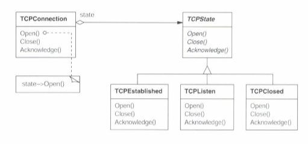
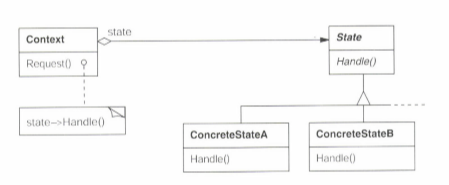

# state
### 다른이름 : 상태 표현 객체(Object for State)


## 기본개념 
객체의 상태에 따른 내부 연산들의 변화를, 상태객체를 이용해 분기처리하는 방식의 디자인 패턴  

## 동기

      

- TCPConnection 클래스는 {연결 성공/대기/연결 종료} 세 종류의 상태를 가질 수 있으며 각 상태별로 연산의 결과가 달라져야 한다.
- 각 상태별로 다른 연산을 구현하기 위해, 모든 상태를 표현하는 TCPState 추상 클래스를 상속받는 각각의 상태 클래스를 만든다.
- TCPConnection객체는 내부상태별로 다른 TCPState 객체를 가지게 되며, 이를 통해 연결 상태별로 특별한 연산을 처리하게 된다. 

## 활용성
### 어떠한 상황에서 사용해야 할까?...
1. 객체의 행동이 상태에 따라 달라질 수 있고, 객체의 상태에 따라 런타임에 행동이 바뀌어야 할 때
2. 어떤 연산에, 객체의 상태에 딸라 달라지는 다중 분기 조건 처리가 __너무 많이__ 들어가있을때

## 구조



- 참여자
    - Context : 사용자가 접근하는 인터페이스. ConcreteState객체를 유지, 관리
    - State : Context의 각 상태별로 필요한 행동을 캡슐화하여 인터페이스로 정의
    - ConcreteState 서브클래스들 : Context의 상태에 따라 처리되어야 할 실제 행동을 구현

- 협력 방법
    - Context객체가 상태에 따른 요청을 받으면, 내부의 ConcreteState 객체로 전달. 
    - 이 때 __Context객체 자기 자신을 매개변수로 전달__ 함으로써, ConcreteState 객체가 Context 내부 정보에 접근할 수 있도록 함.
    - Context객체 또는 ConcreteState 객체는, __자기 다음의 상태를 알고 변경__ 할 수 있어야 함(전이규칙).
    
## 결과 
1. 상태에 따른 행동을 국소화하며, 서로 다른 상태에 대한 행동을 별도의 객체로 관리      
    -> 조건문 지옥을 탈출함으로써 코드분석과 유지보수에 큰 도움  
2. 상태 전이를 명확하게 만든다.
3. 상태 객체의 재사용성

## 구현
### 구현시의 고려사항은...
1. __누가 상태 전이를 정할 것인가?__
    - 일반적으로 ConcreteState 클래스에 정의하는것이 유연하고 적절하다고 책에서는 설명한다.
    - Context에 구현
        - 조건 : 상태 전이의 기준이 명확하게 고정된 경우, Context 클래스 안에 구현이 가능하다.
    - ConcreteState에 구현
        - 조건 : 매개변수로 받은 Context객체의 상태를 변경할 수 있어야 한다.
        - 장점 : 더욱 유연함.
        - 단점 : State의 서브클래스 생성이 더 쉬워지나, 다음에 올 ConcreteState 클래스를 알아야 하므로, 구현 종속성이 생긴다.

2. 테이블 기반의 대안
- 각 상태마다 테이블을 이용하여, 그 상태에서 처리 가능한 입력과 그 입력으로 생길 수 있는 다음 상태를 매핑
- 상태별 다른 연산의 구현에 초점이 맞춰진 기존의 방식과 달리, 상태 전이를 정의 하는 쪽에 초점을 맞춤

3. __상태 객체의 생성과 소멸__
    - 상태 객체를 필요할 때만 생성하고, 필요 없게 되면 없애는 방식 : state의 사이즈가 크고, 상태가 자주 바뀌지 않을 시에 적용
    - 상태 객체를 미리 만들어두고, 없애지 않는 방식 : 상태 변화가 수시로 일어날 경우
    
4. 동적 상속을 이용한 state패턴
    - 대부분의 객체지향 언어에서는 불가능하므로, 참고로 알아만 두자.

## 관련 코드
- 플라이급 패턴
- 단일체

## 예시코드
- 커피머신 예제 . Context에서 상태전이를 담당
```java
public class CoffeeMachine {
     
    private State state;
    private int cup;
    protected int dirtyLevel;
    
    public CoffeeMachine() {
        this.cup = 0;
        this.dirtyLevel=0;
        state = new Normal();
    }
    public void provideCoffee() {
        System.out.println("커피만들기");
    }
    public void sendMessage(String comment) {
        System.out.println(comment);
    }

    public void consumeResource() {
        if(this.cup > 0 )this.cup--;
             
        if(this.dirtyLevel < 100) this.dirtyLevel++;
                 
    }
     
    public void changeState() {
        if(cup==0)state = new EmptyCup();
        else if(dirtyLevel >= 100)state = new Dirty();
        else state = new Normal();
    }
     
    public void clickButton() {
        state.useMachine(this);
        state.SendMessage(this);
    }
}

public interface State {
    public void useMachine(CoffeeMachine cm);
    public void SendMessage(CoffeeMachine cm);
}

public class Normal implements State{

    @Override
    public void useMachine(CoffeeMachine cm) {
        cm.consumeResource();
        cm.provideCoffee();
        cm.changeState();
    }
 
    @Override
    public void SendMessage(CoffeeMachine cm) {
        cm.sendMessage("커피가 나옵니다");
    }
}

public class EmptyCup implements State{
 
    @Override
    public void useMachine(CoffeeMachine cm) {
         cm.cup += 100;
         cm.changeState();
    }
 
    @Override
    public void SendMessage(CoffeeMachine cm) {
        cm.sendMessage("컵을 채우고 있습니다.");
    }
}

public class Dirty implements State{
 
    @Override
    public void useMachine(CoffeeMachine cm) {
        cm.dirtyLevel = 0;
        cm.changeState();
    }
 
    @Override
    public void SendMessage(CoffeeMachine cm) {
        cm.sendMessage("청소중입니다");       
    }
}
```

-커피머신 예제 : concreteState에서 상태이전을 담당
```java
public class CoffeeMachine {
     
    private State state;
    private int cup;
    protected int dirtyLevel;
    
    public CoffeeMachine() {
        this.cup = 0;
        this.dirtyLevel=0;
        state = new Normal();
    }

    public void provideCoffee() {
        System.out.println("커피만들기");
    }
    public void sendMessage(String comment) {
        System.out.println(comment);
    }

    public void consumeResource() {
        if(this.cup > 0 ) this.cup--;
        if(this.dirtyLevel < 100) this.dirtyLevel++;
    }
     
    public void clickButton() {
        state.useMachine(this);
        state.SendMessage(this);
    }
}

public interface State {
    public void useMachine(CoffeeMachine cm);
    public void SendMessage(CoffeeMachine cm);
}

public class Normal implements State{
 
    @Override
    public void useMachine(CoffeeMachine cm) {
        cm.consumeResource();
        cm.provideCoffee();
        
        if (cm.cup == 0) cm.state = new EmptyCup();
        else if (dirtyLevel == 100) cm.state = new Dirty();

    }
 
    @Override
    public void SendMessage(CoffeeMachine cm) {
        cm.sendMessage("커피가 나옵니다");
    }
}

public class EmptyCup implements State{
 
    @Override
    public void useMachine(CoffeeMachine cm) {
        cm.cup += 100;
        cm.state = new Normal();
    }
 
    @Override
    public void SendMessage(CoffeeMachine cm) {
        cm.sendMessage("컵을 채우고 있습니다.");
    }
}

public class Dirty implements State{
 
    @Override
    public void useMachine(CoffeeMachine cm) {
        cm.dirtyLevel = 0;
        cm.state = new Normal();
    }
 
    @Override
    public void SendMessage(CoffeeMachine cm) {
        cm.sendMessage("청소중입니다");       
    }
}

```
예시코드 참고 - 
https://meylady.tistory.com/55