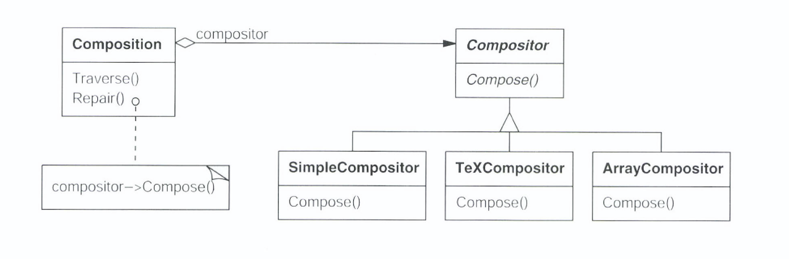
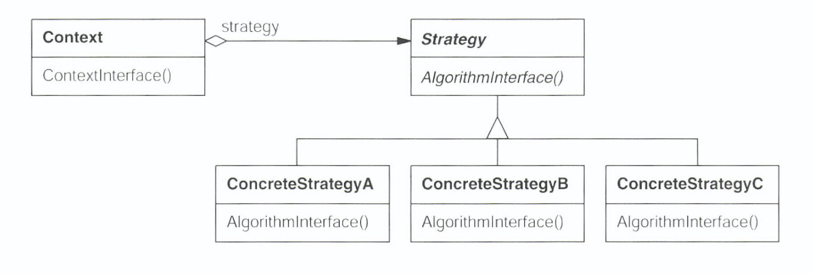

# Strategy

## 의도

- 동일 계열의 알고리즘 군을 정의하고 캡슐화 하여 상호교환 가능하도록 하기 위함
- 알고리즘을 사용하는 클라이언트와 상관없이 독립적으로 알고리즘을 다양하게 변경

## 동기

- 텍스트 뷰어에서 텍스트, 이미지 등을 라인으로 구분하는 알고리즘을 구현해보자
    - 라인으로 구분하는 알고리즘은 여러가지 종류가 있을 수 있음 (어디서 라인을 나누어야 하는지)
- Class에 직접 코딩하는 것은 바람직하지 않음
    - 사용자 프로그램이 복잡해짐
    - 때에 따라 필요한 알고리즘이 다르기 때문
    - 알고리즘과 사용자 코드가 합쳐져 있을 때 새로운 알고리즘을 추가하거나 다양화 하기 어려움
- 따라서 알고리즘을 캡슐화한 Class로 정의하자
    - 캡슐화한 알고리즘을 가리켜 Strategy라함



- 줄 분리  Strategy는 Composition Class에서 구현되지 않고 Compositor의 Concrete Class에서 구현됨
    - SimpleCompositor : 한 번에 한 라인씩 분리하는 간단한 전략
    - TeXCompositor : 한번에 한문단씩 분리하는 전략
    - ArrayCompositor : 각 라인마다 고정된 수의 문자를 갖도록 라인 분리

## 활용성

- 행동들이 조금씩 다를 뿐 개념적으로 관련된 많은 클래스들이 존재할 때
- 알고리즘의 변형이 필요할 때
- 사용자가 몰라야 하는 데이터를 사용하는 알고리즘이 있을 때
- 한 클래스가 많은 행동을 정의하고 이런 행동들이 그 클래스의 연산 안에서 복잡한 조건문의 모습을 취할 때

## 구조 및 참여자



- Strategy
    - 제공하는 모든 알고리즘에 대한 공통된 연산들을 정의
- ConcreteStrategy
    - Strategy Interface를 실제 알고리즘으로 구현
- Context
    - ConcreteStrategy 객체를 통해 구성됨

## 협력 방법

- Context는 다양한 Strategy 중 현재 상황에 적합한 것을 생성하여 Context에 주입함
- Context는 알고리즘에 해당하는 연산이 호출되면 알고리즘 처리에 필요한 데이터를 Strategy Class로 보냄

## 결과

- 동일 계열의 관련 알고리즘 군이 생김
    - 상속을 통하여 공통의 기능을 추출하여 재사용할 수 있음
- 서브 클래싱을 사용하지 않는 대안
    - Context를 기능별로 상속하는 것이 아니라 갈아 끼는 것이므로 서브 클래싱을 사용하지 않음
    - Context와 무관하게 알고리즘을 변경할 수 있고 다양하게 만들어낼 수도 있음
- 조건문을 없앨 수 있음
    - 원하는 행동들을 선택하는 조건문을 없앨 수 있음

```cpp
    // Strategy pattern 적용 이전
    void Composition::repair() {
    	switch (_strategy) {
    	case SimpleStrategy:
    		composeWithSimpleComposition();
    		break;
    	case TeXStrategy:
    		composeWithTexComposition();
    		break;
      }
    }
    
    // Strategy pattern 적용 이후
    void Composition::repair() {
    	_composition->compose();
    }
```

- 구현의 선택이 가능
    - 동일한 행동에 대해 서로 다른 구현을 제공할 수 있음
- 사용자는 서로 다른 Strategy을 알아야 함
    - 사용자는 적당한 Strategy를 선택하기 전에 어떻게 다른지 구 세부 구현을 알고 있어야 함
- Strategy 객체와 Context 객체 사이에 의사소통 오버헤드가 있음
    - 사용되지 않을 매개변수를 Context가 생성하고 넘겨줄 수 있음
- 객체 수가 증가함
    - Strategy들로 객체 수가 증가함

## 구현

- Strategy 및 Context Interface를 정의
    - Context가 Strategy에 필요한 데이터를 넘기는 방식
    - Context가 Strategy에 자기 자신을 인자로 보내고, Strategy 객체가 Context 객체에서 데이터를 요청하는 방법
- Strategy를 Template 매개변수로 사용

```cpp
    template <class AStrategy>
    class Context {
    public:
    	void operation() {
    		strategy.doAlgorithm();
    	}
    private:
    	AStrategy _strategy;
    }
    
    class MyStrategy {
    public:
    	void doAlgorithm();
    }
    
    Context<MyStrategy> aContext;
```

- Strategy 객체에 선택성을 부여
    - Context에 Strategy가 없는 경우 기본 행동을 정의할 수 있음
    - Strategy 객체를 갖지 않는 편이 나을 때, Context 객체를 단순하게 만들 수 있음

## 예제

- Collections#sort()로부터 호출되는 java.util.Comparator#compare()
- javax.servlet.http.HttpServlet의 service() 메소드 및 doXXX() 메소드들
- javax.servlet.Filter#doFilter() 메소드