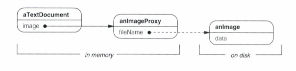
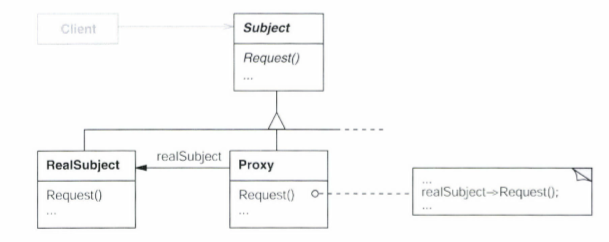

# proxy
### 다른이름 : 대리자(Surrogate)

## 기본개념 
실제 객체의 대리자 역할을 하는 객체

## 동기
객체의 생성 비용이 너무 크거나, 많은 객체를 생성해야 할 때,  
객체를 미리 생성하지 않고 필요한 최소한의 정보를 담은 객체를 생성하고  
이 객체를 통해 실제 객체를 생성하고 접근한다.    
  
  

- ImageProxy 클래스는 Image 객체를 참조함
- 일단 Image객체가 생성되면, ImageProxy 객체의 Draw()메소드와 GetExtent()메소드를 호출하면 Image객체의 메소드를 다시 호출
- extent 필드를 통해 '한계 정보'의 관리

## 구조
### 클래스 다이어그램
  
*proxy는 RealSubject와 동일한 인터페이스를 가지고 있어야 함.
### 객체 다이어그램

## proxy의 네 가지 종류
1. 가상프록시(virtual proxy)
    - 실제 대상객체에 대한 한계 정보를 가지고, 객체의 생성을 지연시킴.
    - 덩치가 큰 객체를 한꺼번에 초기화 하지 않음으로써 메모리의 낭비 및 속도를 크게 개선한다.

2. 원격지 프록시(remote proxy)  
    - 요청 메시지와 인자를 인코딩하여 이를 다른 주소 공간에 있는 실제 대상(stub 객체)에게 전달한다.
    - 객체가 다른 주소공간에 존재한다는 사실을 숨긴다.
    
3. 보호용 프록시(protection proxy)
    - 요청한 Client가 실제 요청할 수 있는 권한이 있는지 확인한다.
    - 원래 객체에 대한 접근을 제어함으로써 접근 제어 권한을 쉽게 다룬다.
    
4. 스마트 참조자(smart reference)
    - 스마트 포인터
    - 실제 객체에 대한 접근이 일어날 때 추가적인 행동(실제 객체의 생성 및 삭제)을 관리한다.
        - 실제 객체에 대한 참조 횟수를 저장하다, 더는 참조가 없을 때 해당 객체를 자동으로 없앤다(스마트 포인터).
        - 맨 처음 참조되는 시점에 영속적 저장소의 객체를 메모리로 옮긴다.
        - 실제 객체에 접근하기 전에 다른 객체가 그것을 변경하지 못하도록 실제 객채에 대한 잠금(lock)을 건다.
    - 기록시점 복사 기법을 통해 최적화.

### 기록시점 복사란?
- 실제 객체를 '원본객체'로 두고, proxy객체는 원본 객체의 참조만을 가져온다.
- 원본 객체의 필드에는 참조된 proxy 객체의 숫자를 저장한다(참조 카운팅 기법)
- proxy객체를 통해 필드를 수정하게 되면, 실제로 원본 객체를 복사하여 사본 객체를 생성하고 참조 카운트를 줄인다.
- 모든 proxy객체가 사본객체가 되면, 참조 카운트는 0이 되고 원본 객체는 삭제된다.

## 사용 예시
- JPA
- ...

## 주의사항
- Proxy가 항상 자신의 실제객체를 알 필요는 없다
    - 필요에 따라서, 모든 실제객체들을 하나의 클래스로 생각하도록 구현
    - 이 때는, Proxy객체의 필드에 이름을 저장하는 등 다른 식별방법을 적용
    
## 언어적 특성의 활용
- C++ 
    - operator-> 연산의 오버로딩
- 스몰토크
    - doesNotUnderstand

## 관련 패턴
- 적응자
- 장식자 