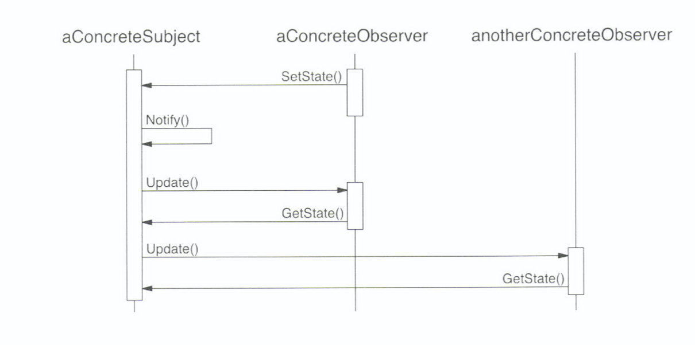

# Observer Pattern (관찰 패턴) 

##  의도

- 객체 사이에 일 대 다의 의존 관계를 정의하여 객체의 상태가 갱신될 때 의존성을 가진 다른 객체들이 변화를 통지받아 자동으로 갱신 하게 함. 

## 동기
- 객체 간에 일관성을 유지하되 객체 간의 결합도를 높이고 싶지않음.

### 예시 - 차트

- 스프레드시트, 차트는 데이터에 의존적임
- 데이터가 변경되면 스프레드시트, 차트도 변경 되어야함 
    
### 활용성
- 어떤 추상 개념이 두 가지 양상을 갖고 **하나가 다른 하나에 종속적일 때**
- **한 객체에 가해진 변경으로 다른 객체를 변경**해야 하고, 프로그래머들은 변경되어야 하는 객체들을 몰라도 될 때
- 어떤 객체가 다른 객체에게 자신의 변화를 통보할 수 있는데, **종속적인 객체들이 누구인지에 대한 가정없이 통보**가 될 때


###  구조 및 참여자
  
- Subject: 감시자들을 알고 있는 주체. 주체는 감시자를 붙이거나 떼는데 필요한 인터페이스 제공.
- Observer: 주체에 생긴 변화에 따른 갱신에 필요한 인터페이스를 정의. 
- ConcreteSubject: 
    - ConcreteObserver 에게 알려줘야하는 상태를 저장. 
    - 상태가 변경될때 감시자에게 통보.
- ConcreteObserver: 
    - ConcreteSubject 에 대한 참조자를 관리. 
    - 주체의 상태와 일관성을 유지해야하는 상태를 저장. 

    
### 협력 방법
 
- ConcreteSubject 는 Observer 의 상태와 잔신의 상태가 달라지는 변경이 발생 할 때 마다 감시자에게 통보.
- ConcreteObserver 는 변경을 통보 받은 이후에 필요한 정보를 주체에게 질의하여 주체의 상태와 자신의 상태를 일치 시킨다.

  
### 결과
- pros:
    - 주체자, 감시자 모두 독립적으로 변형하기 쉬움. 
    - Subject 와 Observer 클래스 간의 추상적인 결합만 존재.
    - Broadcast 방식의 교류를 가능하게 함.
        - 구체적인 수신자를 지정할 필요없이 정보를 원하는 모든 객체들에게 통보.
    
- cons:
    - 예측하지 못한 정보를 갱신
        - 감시자는 다른 감시자의 존재를 모름.
        - 주체에 계속적인 연산이 가해지면 감시자와 주체에 종속된 다른 객체들의 연속적인 수정이 나타날 수 있음.
        - 불필요한 갱신이 일어날 수 있고 추적이 까다로울 수 있음.
        - 갱신 프로토콜로는 주체의 무엇을 변형했는지에 대한 상세 정보를 알 수 없다. 
    
### 구현
- Subject 와 그것의 Observer 를 대응시킨다
    - 가장 쉬운 방법은 Subject 가 Observer 에 대한 참조자를 저장하는 것
    - 별도의 탐색용 자료 구조(ex. HashTable)을 두어 Subject 와 Observer 간의 대응 관계 관리 가능(메모리 절약)
- 하나 이상의 Subject 를 감시.
    - ex. 스프레드 시트는 하나 이상의 데이터에 종속 가능.
    - 감시자가 어떤 주체에 통보가 전달되는지 알아야 한다면 Update() 확장 필요
        - 주체는 Update() 연산을 매개변수화하여 감시자가 어떤 주체를 확인하고 있는지 알 수 있도록 한다
- 갱신의 trigger 
    - case 1. Subject 클래스 상태 변경 후 상태를 지정하는 연산에서 Notify() 호출
        - 장점: Subject 가 정의한 Notify()를 사용자가 호출 하지 않아도 됨.
        - 단점: 계속되는 연산의 수행으로 여러번 수정해야함.
    - case 2. 사용자가 적시에 Notify() 를 호출하는 책임가지도록.
        - 장점: 일련의 상태 변경이 될 때까지 갱신의 시작이 미뤄지고 중간중간 불필요한 수정이 일어나지 않음
        - 단점: 사용자에게 수정하게 하는 추가적 행동을 정의해야함. 사용자가 Notify()를 호출하는 것을 잊을 수 있기 때문.
- 삭제한 Subject 에 대한 무효한(dangling) 참조자를 유지 가능.
    - Subject 가 Observer 에게 자신이 삭제되었으니 감시자에 대한 참조를 없애라고 통보해야함.
- 통보전에 Subject 의 상태가 **자체 일관성(self-consistency)**을 갖추어아함.
    - ex. 통보 후 상태 변경
    - 이 문제를 피하기 위해 템플릿 메서드를 정의할 수 있다.
    ```
    public void cut(T t){
        DoSomething();
        Notify();
    }
    ```
- **Push Model & Pull Model&&
    - Push Model: 주체가 자신의 변경에 대한 상세한 정보를 감시자에게 전달
        - 감시자 클래스의 재사용성이 떨어짐.
    - Pull Model: 주체가 최소한의 정보만 제공하고 감시자가 다시 상세 정보를 요청
        - 무엇이 변했는지 늘 확인해야 한다는 비효율.  
        
- 자신이 관심 있는 변경이 무엇인지 명확하게 지정
    - Subject 클래스에 자신이 관심있는 이벤트에 대한 감시자를 등록하는 인터페이스를 정의하여 갱신을 효율적 갱신 가능.
    - Aspect(양상)을 이용한다
     ```
         public Subject::Attach(Observer observer,Aspect aspect)
         public Observer::Update(Subject subject,Aspect aspect)
     ```
 - 복잡한 갱신의 의미 구조를 캡슐화
    - 주체와 감시자 간의 관련성이 복잡할 때, 관련성을 관리하는 별도의 객체를 생성. (ex. ChangeManager)
        - ChangeManager 의 역할은 감시자가 처리해야하는 주체의 변경처리를 최소화하는 것
        - 세 가지 책임
            - 주체와 감시자를 매핑하고 유지하는 인터페이스 정의.(주체와 감시자는 서로 모르도록)
            - 특별한 갱신 전략을 정의해야 함.
            - 주체에게 요청이 있을 때 모든 독립적 감시자들을 다 수정해야 함.
            
                - SimpleChangeManager: 모든 각 주체에 대한 모든 감시자들을 갱신 
                - DAGChangeManager: 감시자가 하나의 갱신만 요청받도록
                
- Subject 클래스와 Observer 클래스를 합친다
    - 다중 상속을 지원하지 않은 언어에서는 하나의 클래스에 필요한 인터페이스를 합친다.
                
                
            
### 잘 알려진 사용 예
- MVC
    - Model = Subject
    - View = Observer
    
### 관련 패턴
- ChangeManager 는 주체와 감시자 사이의 Mediator 역할.
- ChangeManager 는 일반적으로 Singleton

### 예제 코드
[The Observer Pattern in Java](https://www.baeldung.com/java-observer-pattern)
1. DIY 
```java
public class DIY{
    public class NewsAgency {
        private String news;
        private List<Channel> channels = new ArrayList<>();
     
        public void addObserver(Channel channel) {
            this.channels.add(channel);
        }
     
        public void removeObserver(Channel channel) {
            this.channels.remove(channel);
        }
     
        public void setNews(String news) {
            this.news = news;
            for (Channel channel : this.channels) {
                channel.update(this.news);
            }
        }
    }
    
    public class NewsChannel implements Channel {
        private String news;
     
        @Override
        public void update(Object news) {
            this.setNews((String) news);
        } 
    }
    
    public interface Channel {
        public void update(Object o);
    }
    
    public static void main(String args[]){
        NewsAgency observable = new NewsAgency();
        NewsChannel observer = new NewsChannel();
         
        observable.addObserver(observer);
        observable.setNews("news");
        assertEquals(observer.getNews(), "news");
    }
}
```
2. Observable and Observer 
- Observer interface 는 완벽하지 않아서 Java 9 부터 deprecated. 
- 단점 중 하나는 Observable 가 interface 가 아닌 class 라는 것, 따라서 subclass 가 observable 로 사용될 수 없다.
- subclass 에서 synchronized methods 를 override 하여 thread-safety 가 무너질 수 있다.
```Java
public class ObservableAndObserver{
    
    
    public class ONewsChannel implements Observer {
     
        private String news;
     
        @Override
        public void update(Observable o, Object news) {
            this.setNews((String) news);
        }
    }
    
    public class ONewsAgency extends Observable {
        private String news;
     
        public void setNews(String news) {
            this.news = news;
            setChanged();
            notifyObservers(news);
        }
    }
    
    
    public static void main(String args[]){
        ONewsAgency observable = new ONewsAgency();
        ONewsChannel observer = new ONewsChannel();
         
        observable.addObserver(observer);
        observable.setNews("news");
        assertEquals(observer.getNews(), "news");
    }
}
```
3. PropertyChangeListener
```java
public class PropertyChangeListenerExample{
    
    public static class NewsAgency {
        private String news;

        private PropertyChangeSupport support;

        public NewsAgency() {
            support = new PropertyChangeSupport(this);
        }

        public void addPropertyChangeListener(PropertyChangeListener pcl) {
            support.addPropertyChangeListener(pcl);
        }

        public void removePropertyChangeListener(PropertyChangeListener pcl) {
            support.removePropertyChangeListener(pcl);
        }

        public void setNews(String property, String value) {
            support.firePropertyChange(property, this.news, value);
            this.news = value;
        }
    }

    public static class PoliticalNewsChannel implements PropertyChangeListener {
        private static final String property = "political";
        private String news;

        public void propertyChange(PropertyChangeEvent evt) {
            if (evt.getPropertyName().equals(property))
                this.setNews((String) evt.getNewValue());
        }

        private void setNews(String news){
            this.news =news;
        }
        public String getNews(){
            return this.news;
        }
    }

    public static class SportsNewsChannel implements PropertyChangeListener {
        private static final String property = "sports";
        private String news;

        public void propertyChange(PropertyChangeEvent evt) {
            if (evt.getPropertyName().equals(property))
                this.setNews((String) evt.getNewValue());
        }

        private void setNews(String news){
            this.news =news;
        }

        public String getNews(){
            return this.news;
        }
    }


    public static void main(String args[]) {
        NewsAgency observable = new NewsAgency();
        PoliticalNewsChannel politicalObserver = new PoliticalNewsChannel();
        SportsNewsChannel sportsObserver = new SportsNewsChannel();

        observable.addPropertyChangeListener(politicalObserver);
        observable.addPropertyChangeListener(sportsObserver);
        observable.setNews("political", "political issues");
        observable.setNews("sports", "sports issues");

        System.out.println(politicalObserver.getNews());
        System.out.println(sportsObserver.getNews());
    }
}
```