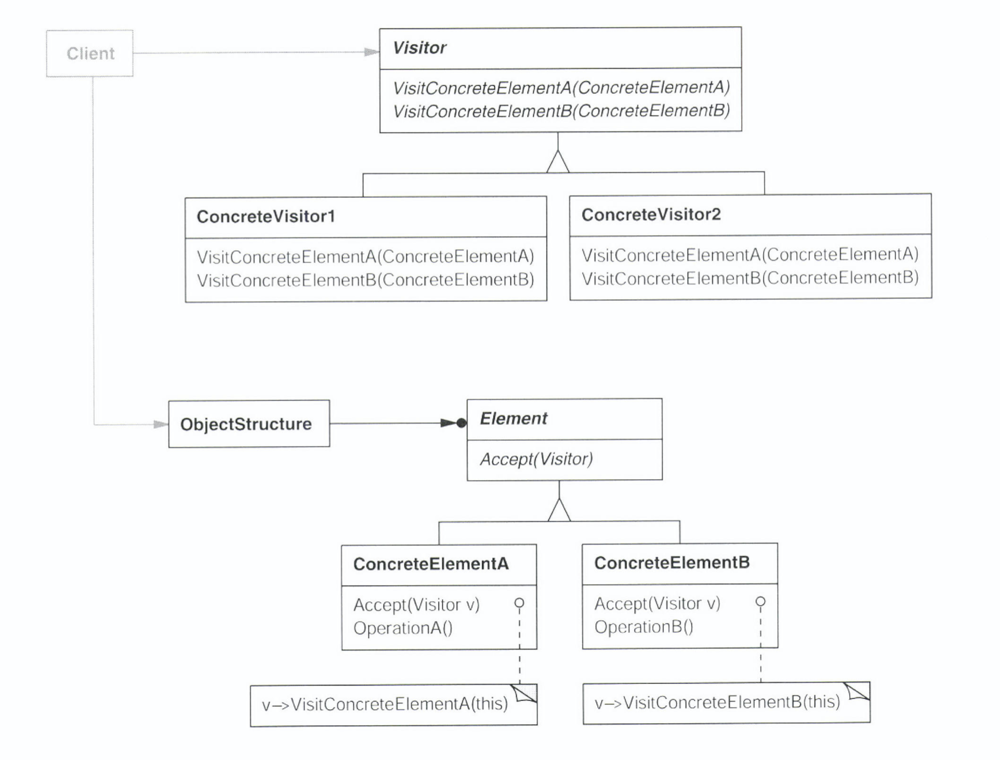

# Visitor Pattern (방문자 패턴) 

##  의도
- 객체 구조를 이루는 원소에 대해 수행할 연산을 표현. 연산을 적용할 원소의 클래스 변경 없이 새로운 연산 정의 가능하게함. 


    
### 활용성
- 다른 인터페이스를 가진 클래스가 객체 구조에 포함되어 있으며, 구체 클래스에 따라 달라진 연산을 이들 클래스의 객체에 대해 수행하고자 할 때
- 특징이 있고 관련죄 않은 많은 연산이 한 객체 구조에 속해있는 객체들에 대해 수행될 필요가 있고, 연산으로 클래스를 더럽히고 싶지 않을 때
- 객체 구조를 정의한 클래스는 거의 변하지 않고 전체 구조에 걸쳐 새로운 연산을 추가하고 싶을 때
    - 객체 구조를 변경하려면 모든 방문자에 대한 인터페이스를 수정해야하므로 객체 구조 변경이 빈번할때는 오히려 비용이 클 수 있음 

###  구조 및 참여자
  
- Visitor 
    - 객체 구조 내에 있는 각 ConcreteElement 클래스를 위한 Visit() 연산을 선언 
    - 연산의 이름과 인터페이스 형태는 Visit() 요청을 방문자에게 보내는 클래스를 식별
- Concrete Visitor
    - Visitor 클래스에 선언된 연산을 구현
    - 알고리즘이 운영될 수 있는 상황 정보를 제공하면 자체 상태를 저장(ex. 객체 순회 도중 순회 결과 누적)
- Element 
    - 방문자를 인자로 받아들이는 Accept() 연산을 선언
- ConcreteElement 
    - 방문자를 인자로 받아들이는 Accept() 연산을 구현
- ObjectStructure
    - 객체 주고 내의 원소들을 나열 할 수 있ㅇ음
    - 방문자가 이 원소에 접근하게 하는 상위 수준 인터페이스 제공
    - Composite 패턴으로 만든 복합체 일 수 있고 컬렉션 일 수도 있음

    
### 협력 방법
 
- 방문자 패턴을 사용하는 사용자는 ConcreteVisitor 클래스의 객체를 생성하고 객체 구조를 따라 각 원소를 방문하며 순회
- visitor 가 각 구성원소들을 방문할 때, 구성 원소는 해당 클래스의 Visitor 연산을 호출
- 각 구성원소들은 Visitor 자신을 연산에 필요한 인자로 제공하여 방문자가 자신의 상태에 접근할 수 있도록 한다

  
### 결과
- pros:
    - Visitor 클래스는 새로운 연산을 쉽게 추가
        - 새로운 방문자의 추가는 객체 구조에 대한 새로운 연산을 추가한 것과 동일
    - Visitor 를 통해 관련된 연산들을 한 군데로 모으고 관련되지 않은 연산을 떼어 낼 수 있음
    - 클래스 계층 구조에 걸쳐서 방문
        - Iterator 의 경우 동일한 타입(공통 부모)을 가진 원소들을 순회하지만
        - 방문자에는 이러한 제약이 없다 
            - ex. 
            ```java
              void visitInteger (Integer integer)
              void visitString (String string)  
          ```
    - 상태를 누적할 수 있다
        
    
- cons:
    - 새로운 ConcreteElement 클래스를 추가하기가 어렵다 
        - ConcreteElement 가 추가될때 마다 Visitor 클래스에 새로운 연산을 추가해야함.
    - 데이터 은닉을 깰 수 있다
        - ConcreteElement 인터페이스가 Visitor 에게 내부 상태 접근에 필요한 연산들을 모두 공개 인터페이스로 제공
       
따라서 객체의 구조에 적용될 **알고리즘** 의 변화가 자주 발생하는지 아니면 **객체구조**의 변화가 자주 발생하는지 보고
방문자 패턴은 전자의 경우에 적합하고 후자의 경우에는 적합하지 않다.  
    
### 구현
- 각 객체 구조는 자신과 연관된 Visitor 인터페이스를 가진다
- 이 Visitor 인터페이스는 각 ConcreteElement 의 클래스를 위한 visitConcreteElement(ConcreteElement element) 연산을 선언한다
- ConcreteVisitor 는 해당 인터페이스를 정의하여 ConcreteElement 를 위한 로직을 구현한다. 
  
### 구현 이슈
- Double Dispatch (이중 디스패치)
    - Single Dispatch : 요청의 이름과 수신자의 타입에 의해 어떤 연산이 요청을 처리할지 결정
    - Double Dispatch : 요청의 종류와 **두 수신자의 타입**(Visitor,Element) 에 의해 결정 
- 객체 순회의 책임은 누가 질 것인가
    - Object Structure 
        - 컬렉션 이라면 각 원소에 대해 Accept() 호출
        - 복합체라면 자식들이 재귀적으로 Accept() 호출 
    - Visitor
        - 각 ConcreteElement 에 대해 ConcreteVisitor 마다 동일한 순회 알고리즘을 적용시켜야 함 
    - 내부 Iterator 
        - 내부 반복자는 객체 구조로 구현되기 때문에 객체 구조에게 순회를 맡기는 것과 흡사하다
            - 차이점은 내부 반복자는 이중 디스패치를 유발하지 않는다
        - 방문자를 인자로 원소에 대한 연사을 호출 하는 것이 아닌 
        - 원소를 인자로 방문자에 대한 연산을 호출
        - 방문자에 대해 호출 되는 연산이 재귀 동작 없이 원소에 대한 연산만 호출한다면 반복자를 사용하는 것이 쉽다 

### 관련패턴
strategy pattern 는 하나의 기능을 구현하는 여러가지 알고리즘에 대한 1:N 의 관계를 다룬다
visitor pattern 는 element 와 visitor 에 따른 N:N 의 관계를 다룬다


### 예제 코드
[The Observer Pattern in Java](https://www.baeldung.com/java-observer-pattern)
1. Declare Element
```java
interface ItemElement 
{ 
    public int accept(Visitor visitor); 
} 
```
2. Implement ConcreteElement
```Java
class Book implements ItemElement 
{ 
    private int price; 
    private String isbnNumber;
    private int age; 
   
    public Book(int cost, String isbn) 
    { 
        this.price=cost; 
        this.isbnNumber=isbn; 
    } 
   
    public int getPrice()  
    { 
        return price; 
    } 
   
    public int getAge()
    {
        return age;
    }   

    public String getIsbnNumber()  
    { 
        return isbnNumber; 
    } 
   
    @Override
    public int accept(Visitor visitor)  
    { 
        return visitor.visit(this); 
    } 
   
} 
  
class Cloth implements ItemElement  
{ 
    private int pricePerKg; 
    private int weight; 
    private String status;
    private String name; 
   
    public Cloth(int priceKg, int wt, String nm) 
    { 
        this.pricePerKg=priceKg; 
        this.weight=wt; 
        this.name = nm; 
    } 
   
    public int getPricePerKg()  
    { 
        return pricePerKg; 
    } 
   
    public int getWeight()  
    { 
        return weight; 
    } 
    public String getStatus()
    {
        return status;
    }
   
    public String getName() 
    { 
        return this.name; 
    } 
   
    @Override
    public int accept(Visitor visitor)  
    { 
        return visitor.visit(this); 
    } 
}
```
3. Declare Visitor  
```java
interface Visitor  
{
    int visit(Book book); 
    int visit(Cloth cloth); 
} 

class ShoppingCartVisitor implements Visitor  
{
     @Override
        public int visit(Book book) 
        { 
            int cost=0; 
            //apply 5$ discount if book price is greater than 50 
            if(book.getPrice() > 50) 
            { 
                cost = book.getPrice()-5; 
            } 
            else 
                cost = book.getPrice(); 
                  
            System.out.println("Book ISBN::"+book.getIsbnNumber() + " cost ="+cost); 
            return cost; 
        } 
       
        @Override
        public int visit(Cloth cloth)  
        { 
            int cost = cloth.getPricePerKg()*cloth.getWeight(); 
            System.out.println(cloth.getName() + " cost = "+cost); 
            return cost; 
        } 
}

class GarageSaleCartVisitor implements Visitor  
{
     @Override
        public int visit(Book book) 
        { 
            int cost=0; 
            //apply 5$ discount if book is published more than 5 years ago 
            if(book.getAge() > 5) 
            { 
                cost = book.getPrice()-5; 
            } 
            else 
                cost = book.getPrice();
            
            System.out.println("Book ISBN::"+book.getIsbnNumber() + " cost ="+cost); 
            return cost; 
        } 
       
        @Override
        public int visit(Cloth cloth)  
        { 
            int cost = cloth.getPricePerKg()*cloth.getWeight(); 
            //additional 10$ premium is added if status of cloth is good 
            if(cloth.getStatus.equals("GOOD"))
                cost+=10;
            System.out.println(cloth.getName() + " cost = "+cost); 
            return cost; 
        } 
}  
```
```java
class Client  
{ 
   
    public static void main(String[] args)  
    { 
        ItemElement[] items = new ItemElement[]{new Book(20, "1234"), 
                              new Book(100, "5678"), new Fruit(10, 2, "Banana"), 
                              new Fruit(5, 5, "Apple")}; 
   
        int total = calculatePrice(items); 
        System.out.println("Total Cost = "+total); 
    } 
   
    private static int calculatePrice(ItemElement[] items)  
    { 
        ShoppingCartVisitor visitor = new ShoppingCartVisitor(); 
        GarageSaleVisitor garageSaleVisitor = new GarageSaleVisitor();
        int sum=0; 
        int sumGarage=0;
        for(ItemElement item : items) 
        { 
            sum = sum + item.accept(visitor);
            sumGarage += item.accept(garageSaleVisitor); 
        } 
        return sum; 
    } 
   
} 
```

### 참고자료
https://en.wikipedia.org/wiki/Double_dispatch
https://www.baeldung.com/java-visitor-pattern
https://www.geeksforgeeks.org/visitor-design-pattern/