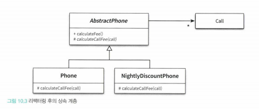

# 10. 상속과 코드 재사용

코드 재사용의 관점에서 '상속'을 살펴볼 것이다.

## 1. 상속과 중복 코드

중복을 피해야 하는 이유 - 중복 코드는 나쁘다

### DRY 원칙

- 중복 코드는 변경을 방해한다.
- 중복 = 요구사항이 변경됐을 때 두 코드를 함께 수정해야 할 때.
    - 코드의 모양이 비슷하다고 다 중복은 아니다!
- DRY = Don't Repeat Yourself
모든 지식은 시스템 내에서 단일하고, 애매하지 않고, 정말로 믿을 만한 표현양식을 가져야 한다.
    - 한 번, 단 한번(Once and Only Once)
    - 단일 지점 제어(Single Point Control) 원칙

### 중복과 변경

- 구현 시간을 절약한 대가는 더 클 수 있다.
- 중복 코드는 새로운 중복 코드를 부른다.
- 그리고, 실수할 여지를 더욱 많이 남기게 된다.

### 상속을 이용하여 중복 코드 제거하기

이미 존재하는 클래스와 유사한 클래스가 필요하다면, 상속을 고려하라.

- 하지만 상속을 염두하지 않고 설계된 클래스를 상속을 이용해 재사용하기는 어렵다.
    - 자식 클래스 작성자가 부모 클래스에 대한 정확한 이해도를 가져야 한다. 즉, 결합도를 높힌다.
    - 그리고, 부모 클래스와 자식 클래스의 결합도는 코드 수정을 어렵게 한다.

### 강하게 결합된 Phone과 NightlyDiscountPhone

- 세금을 부과하는 로직이 중복 됨 → 상속을 사용했음에도 새로운 중복코드 발생
- ***상속을 위한 경고 1***  
자식 클래스의 메서드 안에서 super 참조를 이용해 부모 클래스의 메서드를 직접 호출할 경우 두 클래스는 강하게 결합된다. super 호출을 제거할 수 있는 방법을 찾아 결합도를 제거하라.
- 자식 클래스와 부모 클래스가 강하게 결합한 경우, 자식 클래스가 부모 클래스의 변경에 취약해지는 현상이 발생함 ⇒ 취약한 기반 클래스 문제 (코드 재사용을 목적으로 상속할 때 발생하는 대표적인 문제)

### 멤버 코멘트
- 세훈 : 상속을 사용하면서, super를 사용하지 않을 정도로 결합도를 고려해야 하는가. 상속을 이용하면서 결합도가 강해지는 것은 당연한데...
- 도한 : 결국 tradeoff 문제이기 때문에, 적절히 이용해야 한다.

## 2. 취약한 기반 클래스 문제

- 부모 클래스의 변경에 의해 자식 클래스가 영향을 받는 현상
    - 상속을 사용할 경우 피할 수 없는 객체지향 프로그래밍의 근본적인 취약성
- 상속은 자식 클래스가 부모 클래스의 구현 세부사항에 의존하도록 만들기 떄문에 캡슐화를 약화시킨다.

### 불필요한 인터페이스 상속 문제

- ***상속을 위한 경고 2***   
상속받은 부모 클래스의 메서드가 자식 클래스의 내부 구조에 대한 규칙을 깨트릴 수 있다.

### 메서드 오버라이딩의 오작용 문제

- ***상속을 위한 경고 3***   
자식 클래스가 부모 클래스의 메서드를 오버라이딩 할 경우 부모 클래스가 자신의 메서드를 사용하는 방법에 자식 클래스가 결합될 수 있다.
- 클래스가 상속되기를 원한다면, 상속을 위해 클래스를 설계하고 문서화 해야 한다. - 조슈아 블로치
    - 하지만, 이 또한 문제가 있으니, 문서 자체도 캡슐화를 위반하는 행위이다.
    - 즉, 상속은 캡슐화를 희생할 수 밖에 없다. (트레이드오프 문제)

### 부모 클래스와 자식 클래스의 동시 수정 문제

- ***상속을 위한 경고 4***   
클래스를 상속하면 결합도로 인해 자식 클래스와 부모 클래스의 구현을 영원히 변경하지 않거나, 자식 클래스와 부모 클래스를 동시에 변경하거나 둘 중 하나를 선택할 수밖에 없다.
    - 또한 수정을 위해서 작업자가 부모 클래스를 속속이 알고 있어야 한다.

### 멤버 코멘트
- 세훈 : 예시에서 들어주는 문제들은 개발자들이 객체지향을 잘 몰라서 생기는 문제인 것 같다. 아무리 경력있는 자바 개발자여도 객체지향을 사용하긴 힘들구나.

## 3. Phone 다시 살펴보기

상속으로 인한 피해를 최소화할 수 있는 방법

### 추상화에 의존하자

- 부모 클래스와 자식 클래스 모두 추상화에 의존하도록
- 코드 중복을 제거하기 위한 상속을 도입할 때의 두 가지 원칙
    - 두 메서드가 유사하게 보인다면 차이점을 메서드로 추출하라. 메서드 추출을 통해 두 메서드를 동일한 형태로 보이도록 만들 수 있다.
    - 부모 클래스의 코드를 하위로 내리지 말고 자식 클래스의 코드를 상위로 올려라. 부모 클래스의 구체적인 메서드를 자식 클래스로 내리는 것보다 자식 클래스의 추상적인 메서드를 부모 클래스로 올리는 것이 재사용성과 응집도 측면에서 더 뛰어난 결과를 얻을 수 있다.

### 차이를 메서드로 추출하라

변하는 것으로부터 변하지 않는 것을 분리하라 / 변하는 부분을 찾고 이를 캡슐화하라

### 중복 코드를 부모 클래스로 올려라

- 올릴 때, 메서드를 먼저 옮기면 인스턴스 변수를 옮기는 건 쉽다.
- 오버라이딩 하는 메서드를 한 번 더 메서드로 분리한 후, 그 메서드는 추상 클래스로 옮기고 부모클래스와 자식클래스가 그 추상클래스를 상속받도록 한다.

### 추상화가 핵심이다

- 위와 같이 나누면, 각각의 클래스가 하나의 변경 이유만을 가진다(단일 책임 원칙을 준수한다).
- 즉, 직접 상속하지 말고 추상클래스를 같이 상속받게 하자.
    - 이는 구현에 의존하지 말고 추상화에 의존해야 한다는 원칙과 같다.(9장?)

### 의도를 드러내는 이름 선택하기

### 세금 추가하기

- 메서드 구현에 대한 결합은 추상 메서드를 추가함으로써 어느 정도 완화가 가능하지만, 인스턴스 변수에 대한 결합은 피할 수 없다.
    - 하지만, 객체 생성 로직의 변경에 유연하게 대응할 수 있는 다양한 방법이 존재한다.
    - 따라서 객체 생성 로직에 대한 변경을 막기보다는 핵심 로직의 중복을 막자.

### 멤버 코멘트
- 도한 : filed에도 커플링이 생길 수 밖에 없기 때문에, 생성자 변경이 일어나게 된다. 그래서 composition을 추천하는 것 아닐까.
- 학현 : bean 주입방식을 필드주입 -> 생성자주입 변경하니 상속계층마다 생성자를 만들어줘야 하는 상황 발생. 이번 챕터에 공감이 갔다.

## 4. 차이에 의한 프로그래밍

기존 코드와 다른 부분만을 추가함으로써 에플리케이션의 기능을 확장하는 방법  
중복 코드의 제거, 코드 재사용을 위함

- 상속을 통해 차이에 의한 프로그래밍을 쉽게 실현할 수 있지만
- 상속은 그렇게 좋은 방법이 아니다. 합성을 고려하자.

### 멤버 코멘트
- 학현 : 이펙티브 자바에서, 상속 사용을 고려할 상황에 대해서 얘기해줬는데, 너무 많아서 상속을 쓰지 말라는 얘기로 들렸다.
- 세훈 : JS에서 객체지향이 가능할까...?
- 학현 : 결론은 composotion을 쓰라는 건데, 평소에는 상속을 먼저 생각하게 된다.
- 도한 : 결론은 상속이 나쁘다는 것이 아니라 상속을 사용하되 추상화를 이용하라.
- 세훈 : 개발 시간을 절약하려 할 수록, 여파가 클 수 있겠구나.
