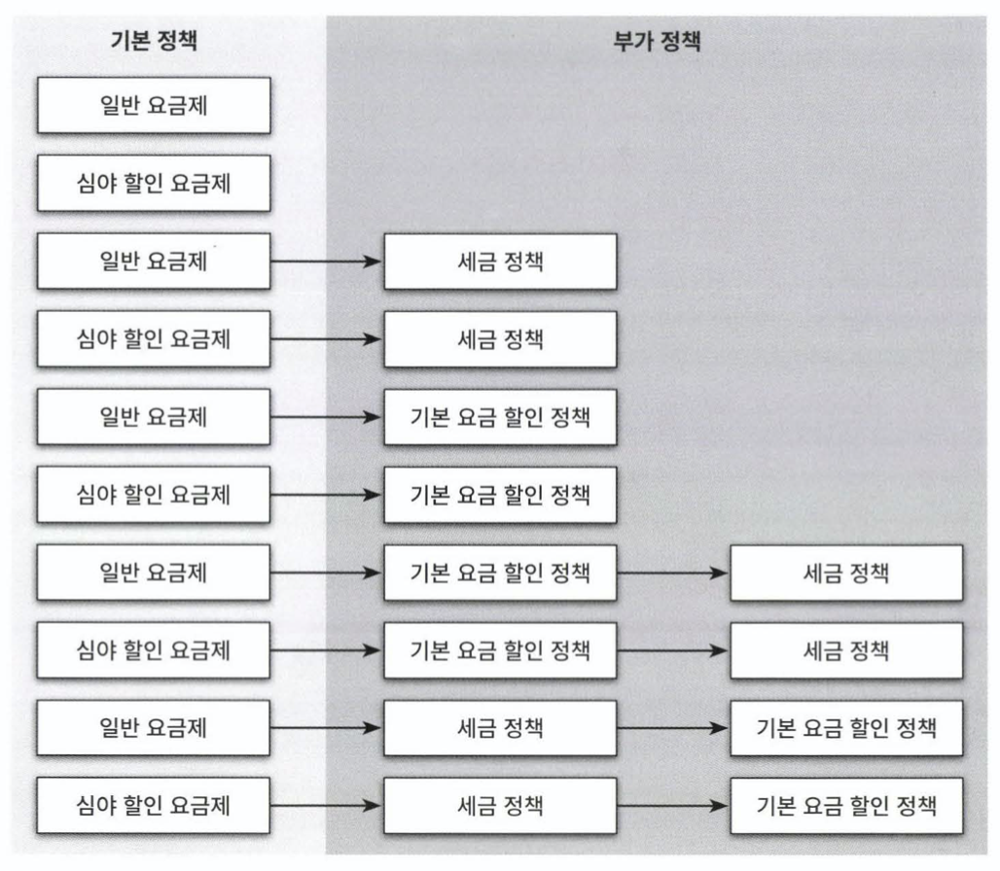
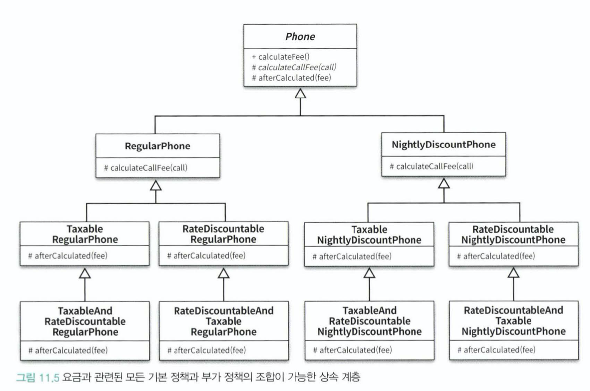
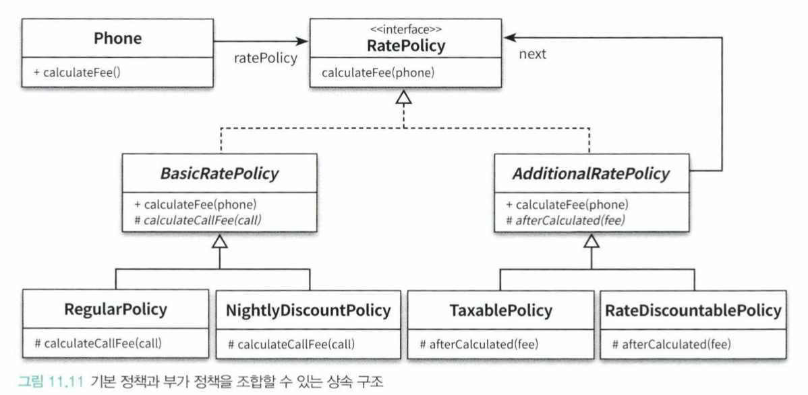

# 11. 합성과 유연한 설계

**상속과 합성**

- 상속
  - 부모 클래스의 구현 코드를 재사용
  - `is a` 관계
  - 컴파일 타임에서 의존성 해결
- 합성
  - 부분 객체의 코드(인터페이스)를 재사용
  - `has a` 관계
  - 런타임에서 의존성 해결

&rarr; **코드 재사용**이라는 목적을 제외하면 모든 면에서 차이가 있다.

- 상속은 부모 클래스의 구현에 의존하기 때문에 결합도가 높아진다.
- 합성은 구현에 의존하지 않고, 퍼블릭 인터페이스에 의존한다.
  - &rarr; 내부 구현이 변경되더라도 영향도가 낮다.

> [코드 재사용을 위해서는] 객체 합성이 클래스 상속보다 좋은 방법이다. [GOF]

## 11.1. 상속을 합성으로 변경하기

**10장 상속의 문제**

- 불필요한 인터페이스 상속: 부적합한 부모의 오퍼레이션을 상속받기 때문에 자식클래스의 상태가 불안정해짐. e.g. `Stack`, `Properties`
- 메서드 오버라이딩의 오작용: 부모클래스 메서드의 호출방법에 영향을 받음 e.g. `InstrumentedHashMap`
- 부모클래스와 자식클래스의 동시 수정: 부모클래스를 변경하면 자식클래스도 변경해야 함 e.g. `PlayList`

- 키워드
  - 메서드 포워딩
  - 몽키 패치

## 11.2. 상속으로 인한 조합의 폭발적인 증가

**상속 결합도가 높아지면 코드 수정의 작업량이 과도하게 늘어난다.**

- 기능을 추가/수정 하기 위해 불필요하게 많은 수의 클래스를 추가하거나 수정해야 한다.
- 단일 상속만을 지원하는 언어는 상속으로 인해 오히려 중복 코드가 늘어난다.

**클래스 폭발** 혹은 **조합의 폭발** 이 발생한다.

## 11.3. 합성 관계로 변경하기

- 상속 관계는 컴파일 타임에서 고정되기 때문에 코드를 실행하는 도중에 변경할 수 없다. &rarr; 클래스 폭발이 발생
- 합성은 런타임에서 해결 &rarr; 퍼블릭 인터페이스에 의존하기 때문에 객체 관계를 변경할 수 있음

- 합성을 사용하면 구현 시점에 정책 관계를 고정시킬 필요 없음
- 다양한 방식의 런타임 의존성을 구성 가능함

> 컴파일 의존성과 런타임 의존성의 거리가 멀어질 수록 설계는 유연해진다.

### 상속은 쓰면 안되는가?

상속의 두 가지 종류

- 구현 상속
- 인터페이스 상속

> 상속에 대한 모든 단점들은 **구현 상속**에 국한된다.

## 11.4. 믹스인

- 객체를 생성할 때 코드 일부를 클래스 안에 섞어서 재사용하는 기법

상속과 믹스인의 차이
- 상속
  - is a 관계로 묶는다.
  - 클래스 관계를 고정시킨다.
- 믹스인
  - 코드를 섞기 위한 방법?
  - 유연하게 관계 재구성이 가능

합성과 믹스인

- 합성
  - 런타임에 객체를 조합
- 믹스인
  - 컴파일 타임에 코드 조각을 조합

**믹스인에서의 this와 super**

- 상속의 경우 this는 동적으로 결정되지만, super는 컴파일 타임에 결정된다.
- 스칼라 트레이트의 경우, super 참조는 동적으로 결정된다. (실행 시점에 바인딩)
  - 트레잇을 사용한 믹스인이 클래스 상속보다 더 유연한 재사용 기법인 이유

- 스칼라는 클래스와 트레잇을 선형화해서 어떤 메서드를 호출한지 결정한다.(p.384)
