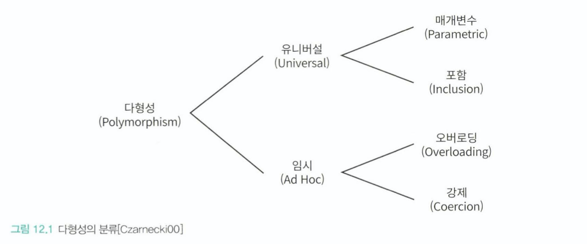
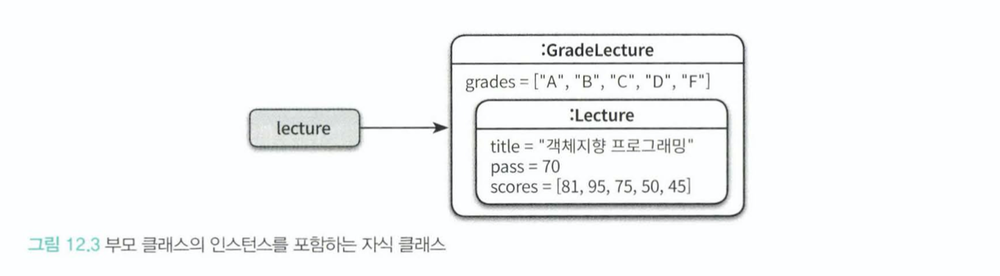
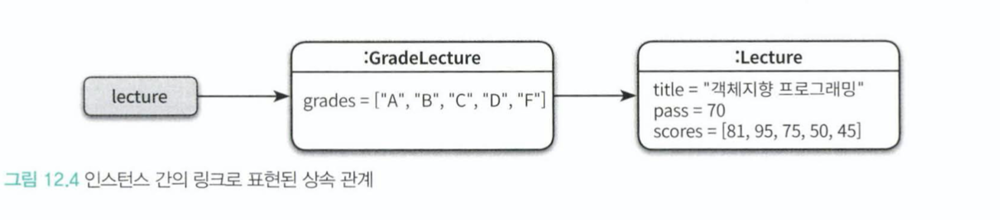
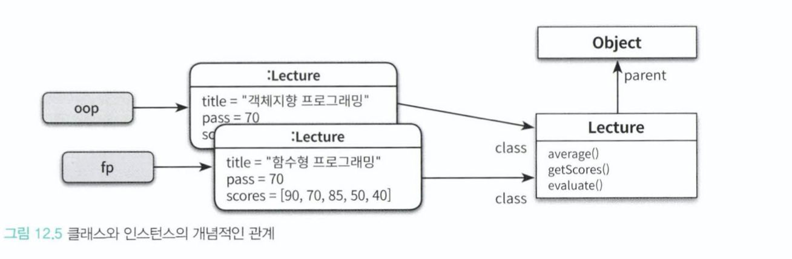
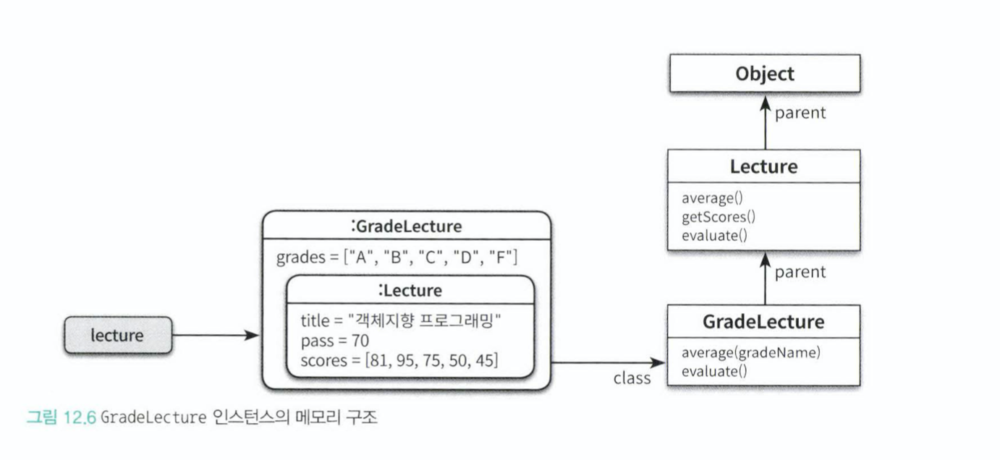
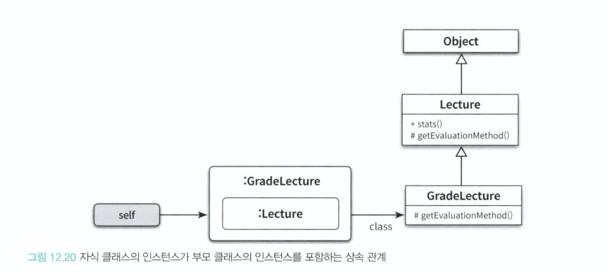

# 12. 다형성

**다형성**

- 상속을 언제 써야할까
    - 코드를 재사용하기 위해서 -> Nop
    - 클라이언트 관점에서 인스턴스들을 동일하게 행동하는 그룹으로 묶기 위해서 -> Ok

## 12.1 다형성
  - 하나의 추상 인터페이스에 대해 코드를 작성하고 이 추상 인터페이스에 대해 서로 다른 구현을 연결할 수 있는 능력
  - 분류 
    
    - Universial (유니버셜)
        - Parameter (매개변수) : 클래스의 인스턴스 변수나 메서드의 매겨변수 타입을 임의의 타입으로 선언한 후 사용하는 시점에 구체적인 타입으로 지정하는 방식
        - Inclusion (포함)/ Subtype : 메시지가 동일하더라도 수신한 객체의 타입에 따라 실제로 수행되는 행동이 달라지는 능력 (일반적으로 다형성이라고 하면 포함다형성을 의미)
    - Ad Hoc (임시)
        - Overloading (오버로딩) : 하나의 클래스 안에 동일한 이름의 메서드가 존재하는 방식(시그니처는 다름)
        - Coercion (강제) : 언어가 지원하는 자동적인 타입변환이나 직접 구현한 타입변활을 이용해 동일 한 연산자를 다양한 타입에 사용할 수 있는 방식

- 포함 다형성을 구현하는 가장 일반적이고 쉬운 방법이 상속을 이용하는 것
    - 포함 다형성의 전제 조건은 자식 클래스가 부모 클래스의 서브타입 이어야한다.
    - **상속의 진정한 목적은 다형성을 위한 서브타입 계층을 구축하는 것** 

## 12.2 상속의 양면성

- 객체지향의 근간은 데이터와 행동을 객체라고 부르는 하나의 실행 단위 안으로 통합하는 것이다.
- 따라서 객체지향 프로그램을 작성 하기 위해서는 항상 데이터와 행동이라는 두 가지 관점을 고려해야 한다.
- 두 가지 관점에서의 상속
    - 데이터: 부모 클래스의 모든 데이터는 자식 데이터에 자동으로 포함 시킬 수 있고
    - 행동: 부모 클래스의 일부 메서드를 자동으로 자식 클래스에 포함 시킬 수 있다
    - 결론: 부모 클래스에서 정의한 데이터와 행동을 자식 클래스에서 자동적으로 공유, 재사용 -> X
    
- 상속의 목적은 코드 재사용이 아닌 **다형성을 가능하게 하는 타입 계층을 구축하기 위함이다**

- 데이터 관점의 상속
    - 자식 클래스의 인스턴스가 부모 클래스의 인스턴스를 포함한다 (그림은 실제 메모리 구조가 아닌 개념적인 표헌이다)
    - 
    - 
    
- 행동 관점의 상속
    - 부모 클래스의 모든 퍼블릭 메서드는 자식 클래스의 퍼들릭 인터페이스에 포함된다
    - 외부의 객체가 부모 클래스의 인스턴스에 전송할 수 있는 모든 메시지는 자식클래스의 인스턴스에게도 전송 할 수 있다 
    
- 런타임에 시스템이 자식 클래스에 정의되지 않은 메서드가 있을 경우 이 메서드를 부모 클래스안에서 탐색한다(체이닝)
- 객체는 서로 다른 상태를 저장하기 위해 인스턴스 별로 독립적인 메서드를 할당 받지만 메서드는 동일 한 클래스끼리 공유가 가능하므로 한번만 로드한다
    -
    -

## 12.3 업캐스팅과 동적 바인딩

- 업캐스팅 : 부모 타입으로 선언된 변수에 자식 클래스의 인스턴스를 할당하는 것
    - 
- 동적 바인딩 : 메시지를 처리할 메서드를 컴파일 시점이 아니라 실행 시점에 결정하는 것
    
## 12.4 동적 메서드 탐색과 다형성
- 객체지향 시스템의 동적 메서드 탐색
    1. 수신 객체는 자신을 생성한 클래스에서 메서드를 찾는다
    2. 부모 클래스에서 메서드를 찾는다 -> 반복 
    3. 최상위 클래스에도 메서드가 존재하지 않는다면 예외 발생 및 탐색 종료
    
- **selt(this) 참조** : 객체가 메시지를 수신하면 컴파일러는 selt 참조라는 임시 변수를 자동으로 생성한 후에 메시지를 수신한 객체를 가리키도록 설정
- 동적 메서드 선택의 두가지 원리
    1. 자동적인 메시지 위임 : 이해할 수 없는 메시지를 부모 클래스에 위임한다
        - 상속을 이용하면 위임과 관련된 코드를 명시적으로 작성할 필요가 없다
        - 상속외의 자동위임이 가능한 방법 : 루비의 모듈, 스칼라의 트레이트 , ....
    2. 메서드를 탐색하기 위해 동적인 문맥을 사용한다 
        - 수신한 객체에 따라 메서드 탐색을 위한 문맥이 동적으로 바뀌는데 self 가 문맥을 결정한다 
        - self 전송 : **현재 클래스의 메서드를 호출하는 것이 아니라 현재 객체에게 메시지를 전송하는 것이다**
 
- 이해할 수 없는 메시지 : 최상위 클래스까지 처리를 위임했지만 메시지를 처리할 수 없다면 프로그래밍 언어에 따라 처리가 달라진다
    - 정적 언어 타입 : 컴파일 타임 때 확인 가능 하므로 컴파일 에러 발생시킨다 
    - 동적 언어 타입 : 몇몇 언어에서는 현재 객체에게 메시지를 이해 할 수 없다는 메시지를 전송 -> 예외를 발생시킨다
        - 동적언어 타입은 좀더 순수한 관점에서 객체지향 패러다임을 구현했다고 볼수 있지만 이해하기 어렵고 디버깅도 어렵다     

- super : 부모 클래스에서 메서드를 찾는 것이 아니라 부모 클래스에서 부터 메서드를 찾는다 
- super send : super 참조에게 메시지를 전송하면 부모 클래스의 인스턴스에 메시지를 전송하는 것 처럼 보인다

## 12.5 상속 대 위임

- 위임과 self 참조 
    - self 참조는 항상 메시지를 수신한 객체를 가리킨다
     
    - 위임 : 자신이 수신한 메시지를 다른 객체에게 동일하게 전달해서 처리를 요청하는 것
        - 처리를 전달할 때 현재 실행 문맥을 가리키는 self 참조를 인자로 전달한다
    - 포워딩 : self 참조를 인자를 전달하지 않고 다른 객체에게 요청을 처리하는 것