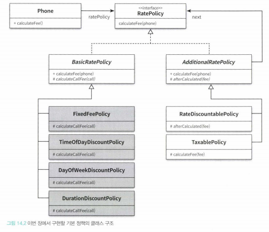
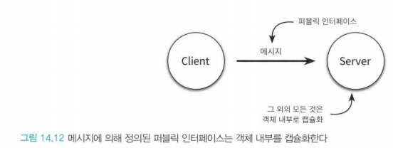
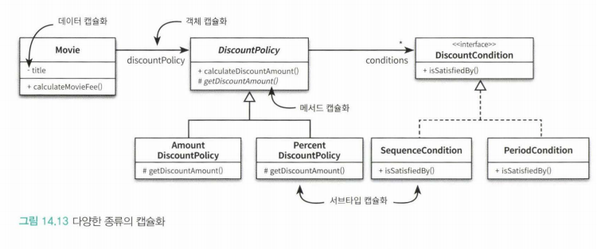
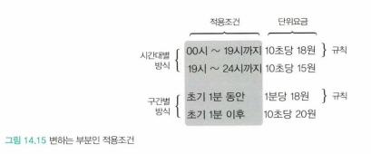
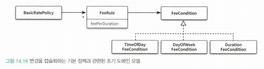
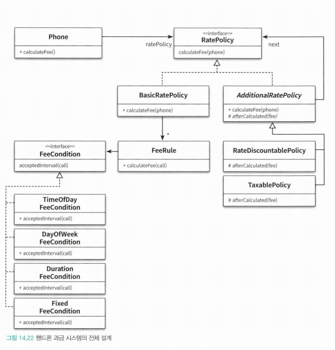

# Chapter 14. 일관성 있는 협력
> 프롤로그  

- 객체지향 설계의 목표는 적절한 책임을 수행하는 객체들의 협력을 기반으로 결합도가 낮고 재사용 가능한 코드 구조를 창조하는 것이다.
- 가능하면 유사한 기능을 구현하기 위해 유사한 협력 패턴을 사용하라.
    - 재사용을 위해서는 객체들의 협력 방식을 일관성 있게 만들어야 한다.
    - 또한 일관성 있는 설계는 코드를 이해하기 쉽게 만들어준다.
    
## 14.1 핸드폰 과금 시스템 변경하기
> 일관성 없는 구현 예시  

- 비일관성의 문제점
    - 새로운 구현의 추가 어려움
    - 기존의 구현 이해 어려움
- 유사한 기능은 유사한 방식으로 구현해야 한다.
    - 그리고 객체지향에서 기능을 구현하는 유일한 방법은 객체 사이의 협력을 만드는 것이다.
    - 그러므로, 유사한 기능들에 대해서 협력을 일관성 있게 만들어야 한다.
    
    
## 14.2 설계에 일관성 부여하기
> 어떻게 일관성을 부여할까?  

- 일관성 있는 설계를 만드는 방법의 조언
    1. 다양한 설계경험을 익힐 것
    2. 디자인 패턴을 학습하고 변경이라는 문맥 안에서 적용해 볼 것.
- 협력을 일관성 있게 만들기 위한 기본 지침
    - 변하는 개념을 변하지 않는 개념으로부터 분리하라.
    - 변하는 개념을 캡슐화하라.
    - 이는 훌륭한 구조 설계의 기본원칙이기도 하다.

### 조건 로직 대 객체 탐색
- 절차지향 프로그램에서 변경을 처리하는 전통적인 방법은 조건문의 분기를 추가하거나 수정
- 객체지향에서의 방법은 조건 로직을 객체 사이의 이동으로 바꾸는 것.
- 다형성은 조건 로직을 객체 사이의 이동으로 바꾸기 위해 객체지향이 제공하는 설계 기법이다.

- 객체지향적인 코드는 조건을 판단하지 않는다. 단지 다음 객체로 이동할 뿐이다.

- 조건 로직을 객체 사이의 이동으로 대체하기 위해서는 큰 클래스를 작은 클래스들로 분리해야 한다.
    - 기준은 변경의 이유와 주기이다.
    - 단일 책임 원칙을 따르도록 클래스를 분리해야 한다.
- 이렇게 되면 인스턴스들 사이의 협력 패턴에 일관성을 부여하기 더 쉬워지는데
    - 유사한 행동을 수행하는 작은 클래스들이 자연스럽게 역할이라는 추상화로 묶이게 되며, 
    - 역할 사이에서 이뤄지는 협력 방식이 전체 설계의 일관성을 유지할 수 있게 이끌어주기 때문.

- 변하는 개념을 별도의 서브타입으로 분리한 후, 이 서브타입들을 클라이언트로부터 캡슐화
    1. 조건문을 개별적인 객체로 분리
    2. 객체들과 일관성 있게 협력하기 위해 타입 계층 구성
    3. 타입 계층을 클라이언트로 분리하기 위해 역할 도입
    4. 최종적으로 역할을 추상 클래스와 인터페이스로 구현

- 추상화에 대한 의존은 결합도를 낮추고, 대체 가능한 역할로 구성된 협력을 설계할 수 있게 해준다.
- 따라서 선택하는 추상화의 품질이 캡슐화의 품질을 결정한다.

- 캡슐화 기법들
    - 6장 : 인터페이스 설계 원칙
    - 8, 9장 : 의존성 관리 기법
    - 10장 : 상속
    - 11장 : 합성
    - 13장 : 리스코프 치환원칙

- 변경에 초점을 맞추고 캡슐화의 관점에서 설계를 바라보면 일관성 있는 협력 패턴을 얻을 수 있다.
    
### 캡슐화 다시 살펴보기
- 캡슐화는 변할 수 있는 모든 '개념'을 감추는 것이다.
- 캡슐화의 가장 대표적인 예는, 객체의 퍼블릭 인터페이스와 구현을 분리하는 것

- 다양한 캡슐화의 종류
    - 데이터 캡슐화
    - 메서드 캡슐화
    - 객체 캡슐화
    - 서브타입 캡슐화

- 코드 수정으로 인한 파급 효과를 제어할 수 있는 모든 기법이 캡슐화의 일종이다.
    - 개별 객체에 대한 변경을 관리
        - 데이터 캡슐화
        - 메서드 캡슐화
    - 협력에 참여하는 객체들의 관계에 대한 변경을 관리
        - 객체 캡슐화
        - 서브타입 캡슐화
- 협력을 일관성 있게 만들기 위해 사용하는 가장 일반적인 캡슐화는 서브타입 캡슐화와 객체 캡슐화를 조합하는 것.
    - 서브타입 캡슐화 <- by 인터페이스 상속
    - 객체 캡슐화 <- by 합성
- 서브타입 캡슐화와 객체 캡슐화의 적용 방법
    - 서브타입 캡슐화 : 변하는 부분을 분리해서 타입 계층을 만든다 => 인터페이스 상속
    - 객체 캡슐화 : 변하지 않는 부분의 일부로 타입 계층을 합성한다 => 합성

- 변경의 이유에 따라 캡슐화 할 수 있는 더 다양한 방법은 디자인 패턴을 통해 더 배울 수 있다.

## 14.3 일관성 있는 기본 정책 구현하기
> 일관성 있는 구현 예시  

### 변경 분리하기
- 변하지 않는 개념과 변하는 개념을 분리

- 적용 조건의 세부 내용이 변화에 해당한다.

### 변경 캡슐화하기
- 변하는 부분의 공통점을 추상화하고, 변하지 않는 부분이 오직 이 추상화에만 의존하도록 관계를 제한하여 변경을 캡슐화한다.
    - 변하지 않는 것 : 규칙
    - 변하는 것 : 적용조건
- 서브타입 캡슐화 : '규칙'으로부터 '적용조건'을 분리해서 추상화 한 후 시간대별, 요일별, 구간별 방식을 이 추상화의 서브타입으로 만든다.
- 객체 캡슐화 : 규칙이 적용조건을 표현하는 추상화를 합성 관계로 연결한다.

- 변하는 FeeCondition의 서브타입은 변하지 않는 FeeRule로부터 캡슐화된다.
-> feeRule이'적용 조건'이라는 변경에 대해 캡슐화 된다.

### 협력 패턴 설계하기

### 추상화 수준에서 협력 패턴 구현하기
- 변하는 것과 변하지 않는 것을 분리하고 변하는 것을 캡슐화한 코드는, 오로지 변하지 않는 것과 추상화에 대한 의존성만으로도 전체적인 협력을 구현할 수 있다.
- 변하는 것은 추상화 뒤에 캡슐화 되어 숨겨져 있기 때문에 전체적인 협력의 구조에 영향을 미치지 않는다.

### 구체적인 협력 구현하기
- 각 서브타입의 실제 구현 예시
- 기능 추가 시 따라야 하는 구조를 강제
    - 설계의 일관성 유지
    - 코드 이해가 쉬워짐
    - 개발자는 작은 문제에 집중할 수 있는 자유
    - 개념적 무결성을 유지
- 협력을 설계한다면, 기존의 협력 패턴을 따를 수 없는지 고민하라(개념적 무결성을 지키는 방법).

### 협력 패턴에 맞추기

- 개념적 무결성을 무너뜨리는 것보다는 약간의 부조화를 수용하는 편이 더 낫다.

- 지속적으로 개선하라
    - 협력은 고정된 것이 아니다.
    - 맹목적으로 일관성을 맞추는 것이 아니라 달라지는 변경의 방향에 맞춰 지속적으로 리팩터링하라.

### 패턴을 찾아라
- 변경의 방향을 파악
- 변경에 탄력적으로 대응할 수 있는 다양한 캡슐화 방법과 설계 방법을 익힌다.
- 협력을 일관성 있게 만든다는 것 -> 유사한 변경을 수용할 수 있는 협력 패턴을 발견하는 것.

## 스터디 코멘트

도한
- 일관성있는 해결 기법 자체를 첫 개발자가 잘 설계하는 것이 중요.  
협력 관점에서 책임을 잘 할당하고 잘 할당하기 위해 위의 내용을 따르는 것.
- 개발자와 개발자 사이의 협력도 고려해야 할 점.

학현
- 협력을 잘 적용해도, 일관성이 없다면 협력이라는 것 자체가 퇴색될 것이다.  
그냥 협력이 아니라 일관성 있는 협력이 중요할 것이다.

관수
- 캡슐화 내용이 좋았다.